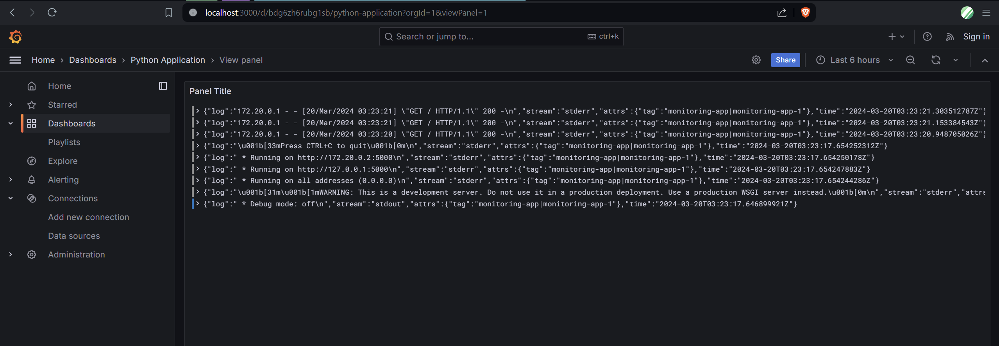
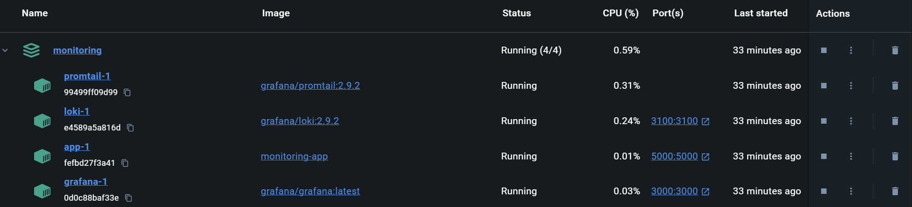
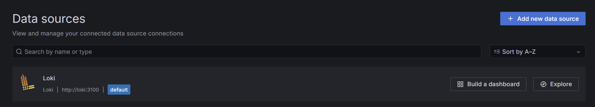
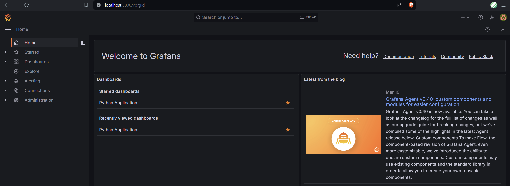

# Logging for Python Application

## Overview



Logging for the application is done with Grafana Loki and Promtail agent.
It is set up alongside the application with Docker Compose.



## Components role

### Application


The application itself uses default `json-file` driver for Docker logs with the following options:

```yaml
max-size: "200k"
max-file: "10"
tag: "{{.ImageName}}|{{.Name}}"
```

Here `tag` option is important as it will be subject to filter by.

The application runs on `localhost:5000`.

### Loki



Loki is the main server that gathers, stores and processes logs.
In our scenario, it takes logs from Promtail agent and displays them via Grafana.

Loki runs on `localhost:3100` and uses default configuration.

### Grafana



Grafana is used for querying and displaying log data.
It is hosted on `localhost:3000` and is configured to use Loki as the datasource.

### Promtail

Promtail is used as agent to scrape logs and push them to Loki.
It uses custom configuration adapted from [Promtail Configuration Example](https://github.com/black-rosary/loki-nginx/blob/master/promtail/promtail.yml) to scrape Docker containers' logs.

The agent collects logs from `/var/lib/docker/containers` which is mounted as a Docker Volume.
