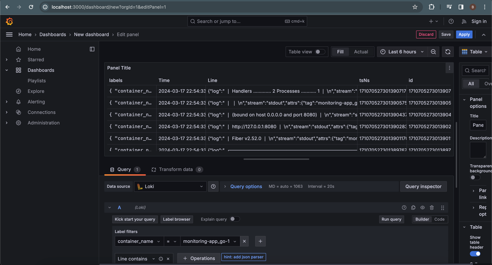
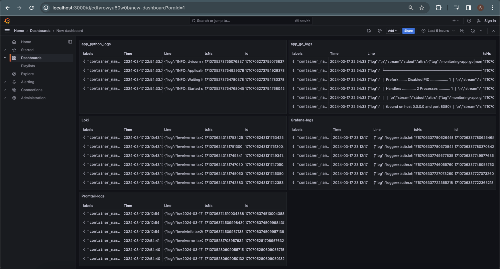

# Logging Stack Documentation

## Overview
The documentation provides information about logging stack configured using Promtail, Loki, and Grafana. 
These all was combined using docker-compose and two web apps on python and go from previous labs.

## Components

### Grafana
- **Purpose**: Grafana serves for visualization and monitoring.
- **Functionality**:
  - It offers a web-based interface for querying and visualizing log data.
  - Configured with anonymous authentication and admin privileges.
  - Sets up a data source for Loki, allowing Grafana to query Loki's stored logs.
  - Accessible via port 3000.

### Loki
- **Purpose**: Loki is a scalable log aggregation system inspired by Prometheus.
- **Functionality**:
  - It receives log streams from Promtail.
  - Logs are stored in a compressed, indexed format.
  - Accessible via port 3100.
  - Configuration is done using a local file.
  - The configuration has two labels `image_name` and `container_name`

### Promtail
- **Purpose**: Promtail collects and sends logs to Loki.
- **Functionality**:
  - Monitors log files on the host and sends log lines to Loki.
  - Uses a local configuration file (`promtail.yml`) to specify scrape targets and settings.
  - Accessible via port 9080.

### Application Services (app_python, app_go)
- **Purpose**: These services, written in Python and Go, respectively, expose endpoints for application functionality - same one endpoint (`GET /`) for getting moscow time.
- **Functionality**:
  - Logs are captured by Docker's default JSON-file logging driver with custom rotation settings.
  - All logs are written into stdin
  - Both services are part of the `loki` network, enabling communication with Loki and Grafana.

## Logging Configuration
- **Logging Driver**: Docker's JSON-file logging driver with custom rotation settings.
- **Log Format**: Log entries are formatted as JSON.
- **Tagging**: Each log entry is tagged with the image name and container name.

## Integration
- **Promtail and Loki**: Promtail sends log streams to Loki for storage.
- **Grafana and Loki**: Grafana queries log data stored in Loki for visualization and monitoring.

## Conclusion
The logging stack, comprising Grafana, Loki, and Promtail, provides a comprehensive solution for log aggregation, storage, visualization, and monitoring, enhancing the efficiency of log management and troubleshooting for the deployed applications.

