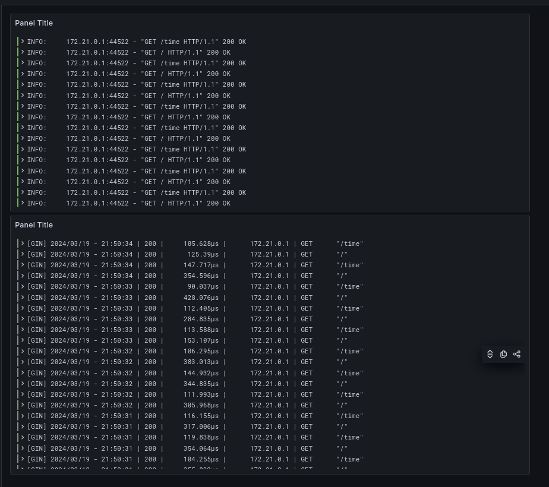

# Logging

The following compose contains 5 services:

- `app_python`: Container with python web application.
- `app_go`: Container with go web application.
- `loki`: Loki log aggregation system.
- `promtail`: Log shipper for grafana.
- `grafana`: Grafana log dashboard.

## Results

As a result, I've created 2 dashboards: for python_app and for go_app logs.

