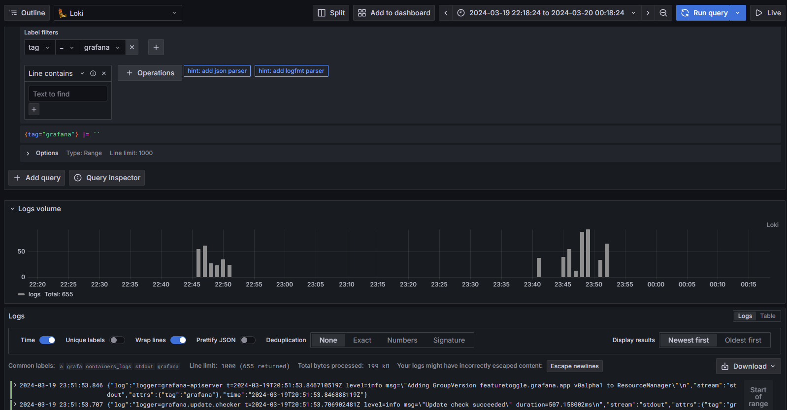
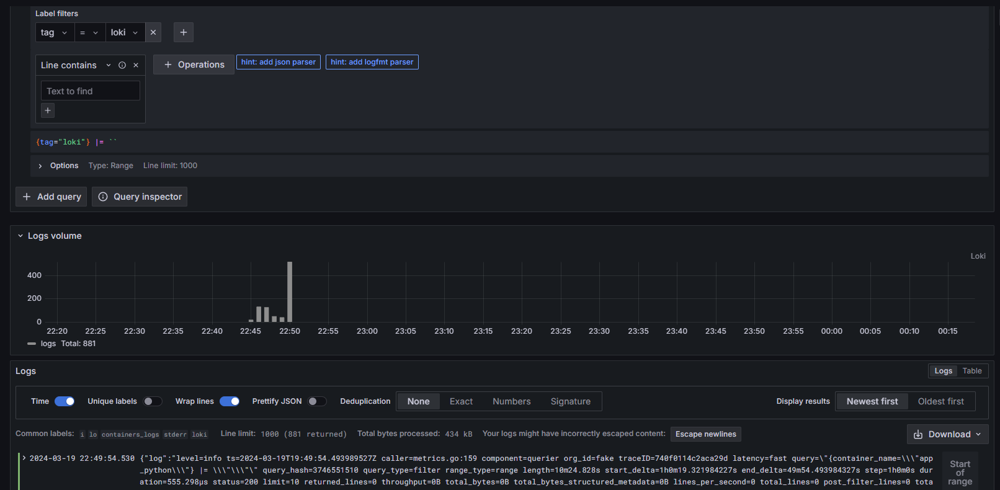
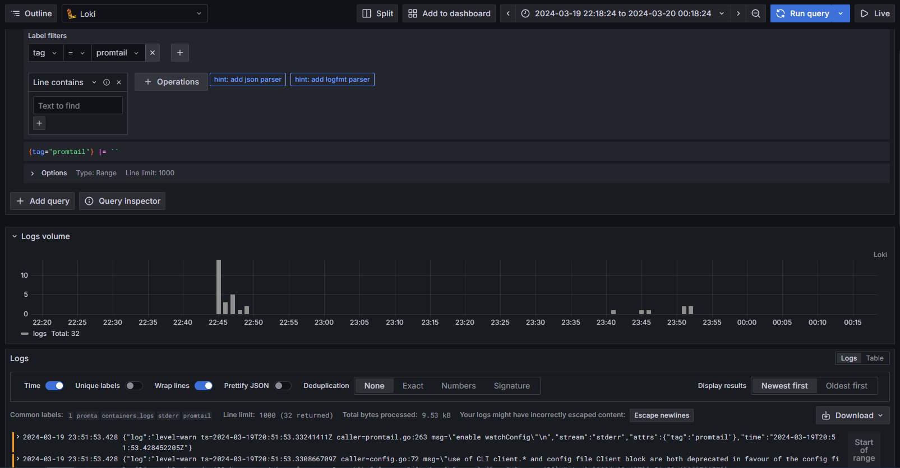
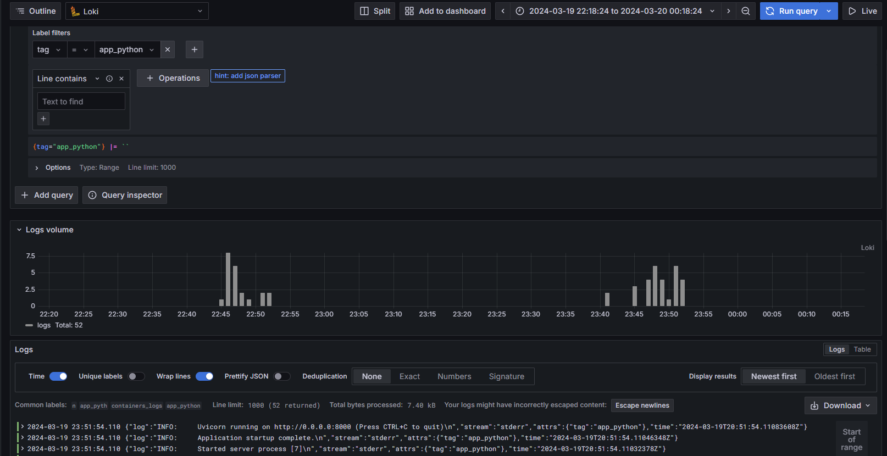
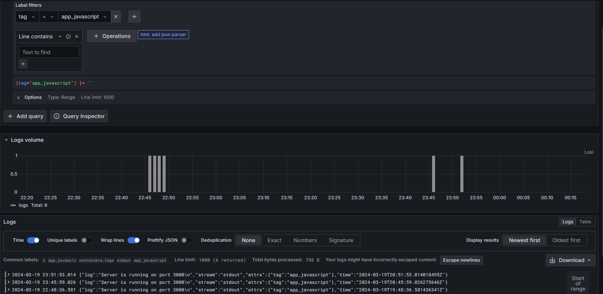

# Logging

## Components

### Grafana

In this logging stack, Grafana visualizes the logs/metrics in the web interface exposed at port `3000`. It provides the UI for data aggregation and visualization. Displays the queries results from loki.

### Loki

It is responsible for aggregating and storing the logs. Handles the queries.

### Promtail

It processes the local logs and transfers them to loki.

## Screenshots

### Grafana logs

### Loki logs

### Promtail logs

### Python app logs

### Javascript app logs

