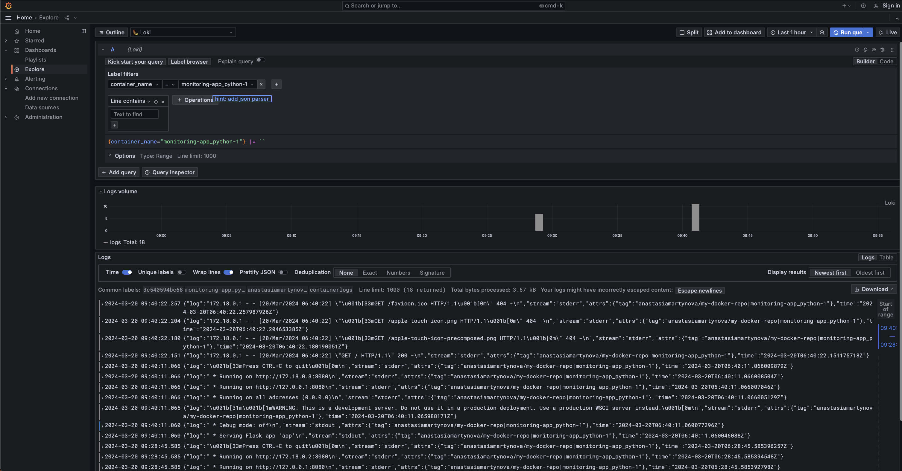
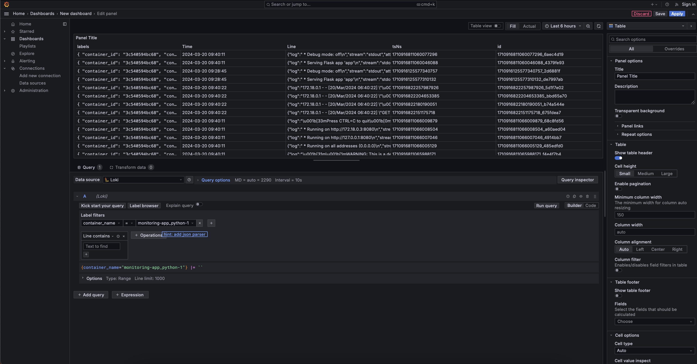

## Logging Stack Report

### Components

- **Grafana** represents an open-source analytics and interactive visualization web application, designed to offer charts, graphs, and alerts for web-based data visualization when integrated with compatible data sources. In the context of this stack, Grafana serves as the visualization component, responsible for rendering logs and metrics collected by Loki and Promtail.
- **Promtail** functions as an agent that facilitates the transmission of local log data to a designated Loki instance. This deployment strategy ensures that every machine hosting applications requiring monitoring is equipped with Promtail.
- **Loki's** contribution to this stack is primarily focused on log storage and querying capabilities. Unlike traditional log management systems that index log content, Loki indexes a collection of labels associated with each log stream, enabling efficient querying of log data.
- **The Flask application** is a straightforward web application designed to display the current time in Moscow. This application is instrumental in generating logs for the monitoring stack, serving as a test case for log generation and analysis.

### Screenshots

