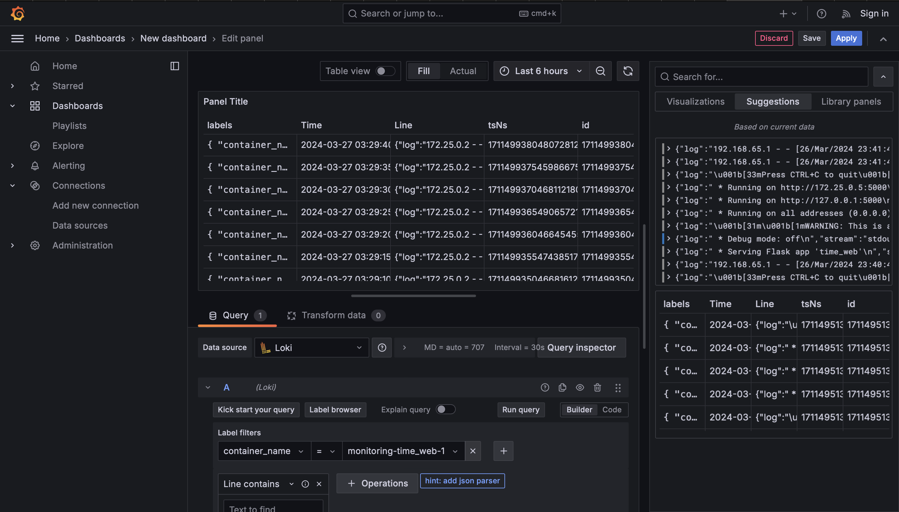
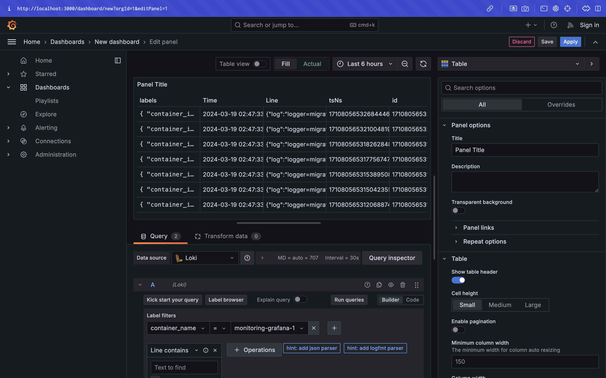
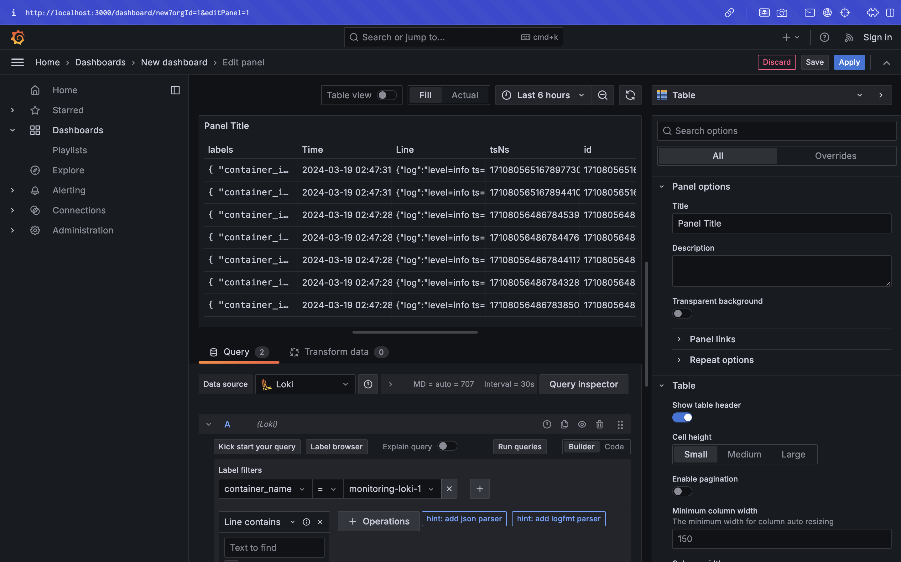

# Logging Stack Overview

This report presents an outline of the logging stack configuration detailed within the `docker-compose.yml` file.

## Analysis of docker-compose.yml

### app-python

- **Functionality:** Represents the Python application.
- **Logging Configuration:** Utilizes the `json-file` logging driver.
- **Specifications:** Tags log entries with `{{.ImageName}}|{{.Name}}`.

### loki

- **Objective:** Acts as a log aggregation service.
- **Container Image:** Employing grafana/loki:2.9.2.
- **Port Settings:** Exposes port 3100.
- **Execution Command:** Implements a local configuration file located at `/etc/loki/local-config.yaml`.

### promtail

- **Objective:** Serves as a log collection agent.
- **Container Image:** Utilizing grafana/promtail:2.9.2.
- **Volume Configuration:** Mounts `./promtail.yml:/etc/promtail/config.yml` and `/var/lib/docker/containers:/var/lib/docker/containers`.
- **Execution Command:** Utilizes a local configuration file located at `/etc/promtail/config.yml`.

### grafana

- **Objective:** Visualization tool designed for logs.
- **Environment Variables:** 
  - `GF_PATHS_PROVISIONING=/etc/grafana/provisioning`
  - `GF_AUTH_ANONYMOUS_ENABLED=true`
  - `GF_AUTH_ANONYMOUS_ORG_ROLE=Admin`
- **Entrypoint Configuration:** Configures datasource for Loki within `/etc/grafana/provisioning/datasources/ds.yaml`.
- **Container Image:** Utilizes grafana/grafana:latest.
- **Port Configuration:** Exposes port 3000.

## promtail.yml Configuration Overview

This promtail.yml setup facilitates the collection and processing of logs from Docker containers, forwarding them to Loki for storage and analysis.

### Server Configuration
Specifies the ports for the Prometheus server to listen on, setting `http_listen_port` to `9080` for handling HTTP requests.

### Positions Configuration
Designates the path to the positions file utilized by the Prometheus server to track the last scrape position for each target.

### Clients Configuration
Specifies the URL to which Prometheus should deliver metrics, denoting `http://loki:3100/loki/api/v1/push`, indicating Loki as the destination.

### Scrape Configurations
- `job_name`: Identifies the name of the job for scraping metrics, configured as `docker`.
- `static_configs`: Specifies the targets for scraping, with only `localhost` targeted in this instance.
- `labels`: Adds supplementary labels to scraped metrics.
- `__path__`: Determines the path pattern for matching log files to scrape, targeting log files within Docker container directories.
- `pipeline_stages`: Defines a sequence of processing stages for scraped log lines, including JSON parsing, extraction of specific fields using regular expressions, timestamp conversion, addition of labels, and specification of the final output format.

# Screenshots
### App python

### Grafana

### Loki

### Promtail

