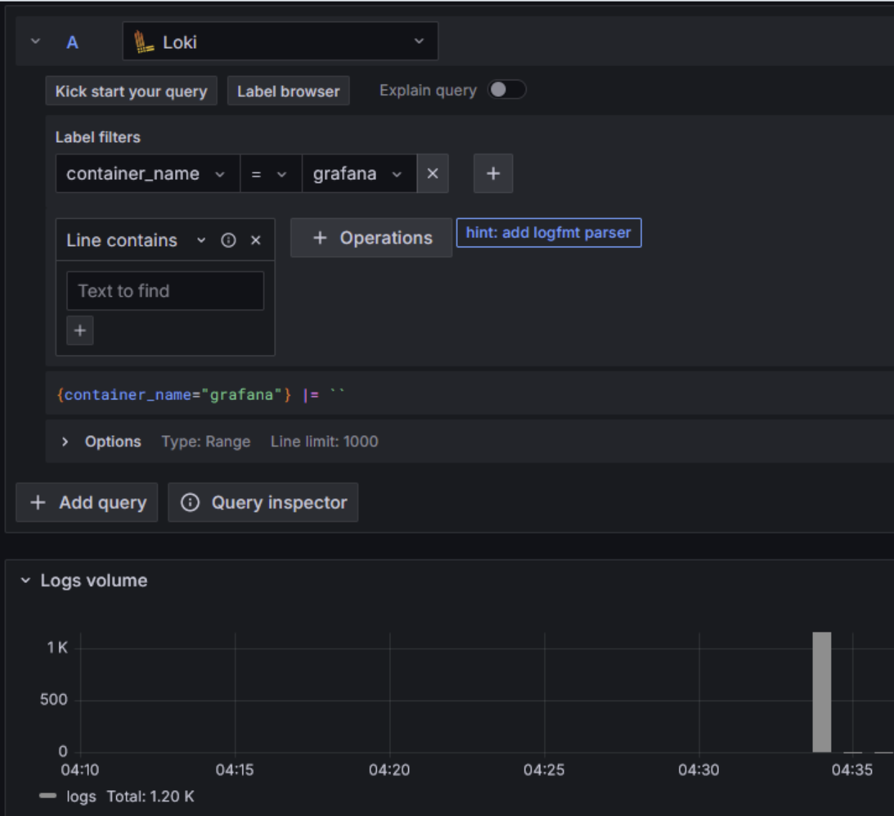

# Loggging

## Logging Stack

- Grafana is a graphical user interface for visualizing data
- Loki is a specialized system created for effective log aggregation
- Promtail functions as an intermediary agent transferring local log data to Loki for processing

## Gallery

