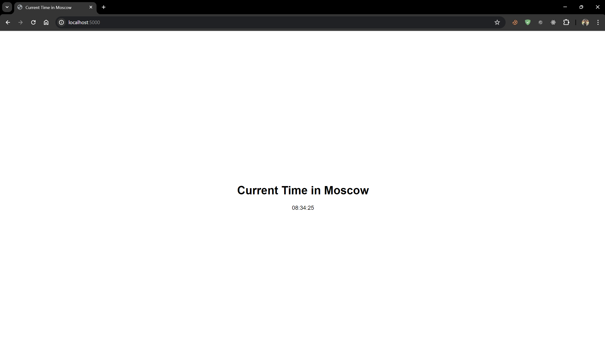
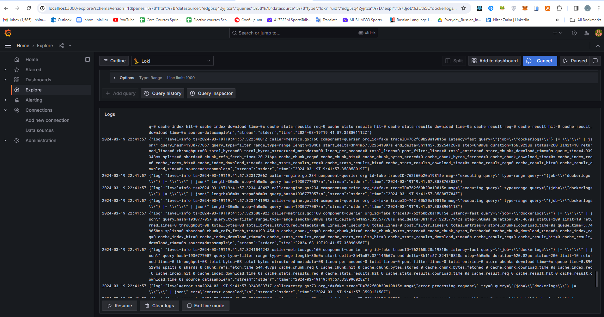
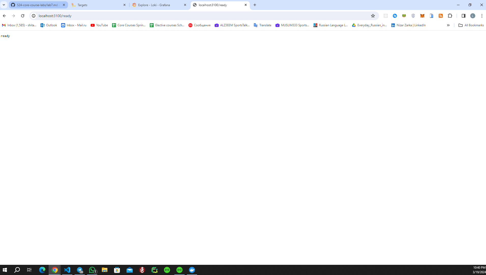
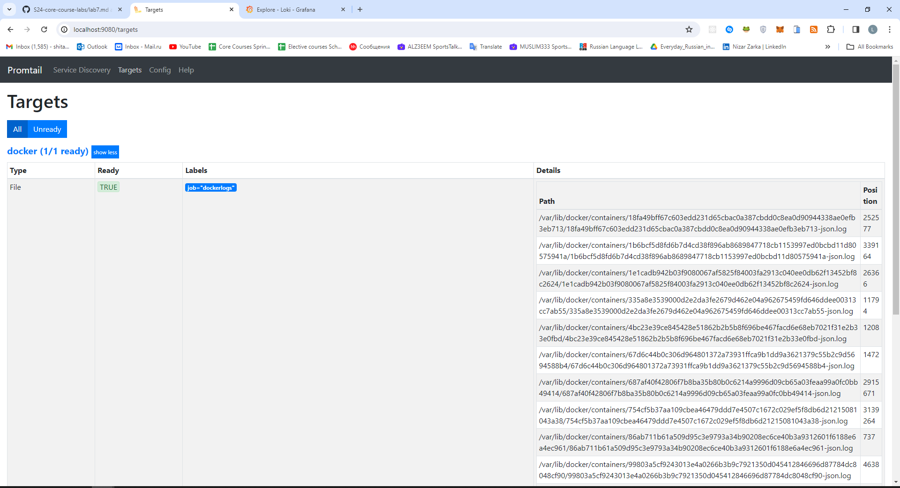

# Logging Stack Report

This document provides an overview of the logging stack configured in the `docker-compose.yml` file.

## Overview of docker-compose.yml

### app-python

- **Purpose:** Represents the Python application.
- **Logging Driver:** Uses the `json-file` logging driver.
- **Options:** Tags log messages with `{{.ImageName}}|{{.Name}}`.

### loki

- **Purpose:** Log aggregator service.
- **Image:** grafana/loki:2.9.2.
- **Ports:** Exposes port 3100.
- **Command:** Uses a local configuration file `/etc/loki/local-config.yaml`.

### promtail

- **Purpose:** Log collection agent.
- **Image:** grafana/promtail:2.9.2.
- **Volumes:** Mounts `./promtail.yml:/etc/promtail/config.yml` and `/var/lib/docker/containers:/var/lib/docker/containers`.
- **Command:** Uses a local configuration file `/etc/promtail/config.yml`.

### grafana

- **Purpose:** Visualization tool for logs.
- **Environment Variables:** 
  - `GF_PATHS_PROVISIONING=/etc/grafana/provisioning`
  - `GF_AUTH_ANONYMOUS_ENABLED=true`
  - `GF_AUTH_ANONYMOUS_ORG_ROLE=Admin`
- **Entrypoint:** Configures datasource for Loki in `/etc/grafana/provisioning/datasources/ds.yaml`.
- **Image:** grafana/grafana:latest.
- **Ports:** Exposes port 3000.

## Overview of promtail.yml

This promtail.yml configuration enables Promtail to collect and process logs from Docker containers and push them to Loki for storage and analysis.

### Server Configuration
Specifies the ports for Prometheus server to listen on, with `http_listen_port` set to `9080` for HTTP requests.

### Positions Configuration
Specifies the path to the positions file used by Prometheus server to track the last scrape position for each target.

### Clients Configuration
Defines the URL to which Prometheus should push metrics, in this case `http://loki:3100/loki/api/v1/push`, indicating Loki as the destination.

### Scrape Configurations
- `job_name`: Specifies the name of the job for scraping metrics, set to `docker`.
- `static_configs`: Defines the targets to scrape, with only `localhost` targeted in this case.
- `labels`: Adds additional labels to scraped metrics.
- `__path__`: Specifies the path pattern for matching log files to scrape, targeting log files in Docker container directories.
- `pipeline_stages`: Defines a series of processing stages for scraped log lines, including parsing JSON, extracting specific fields using regular expressions, converting timestamps, adding labels, and specifying the final output format.

# Screenshots

