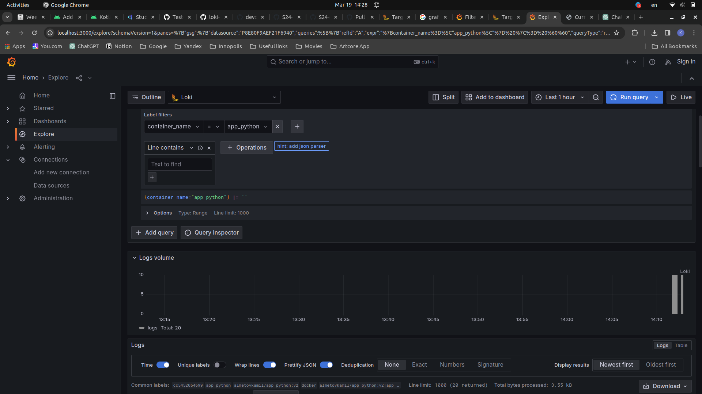
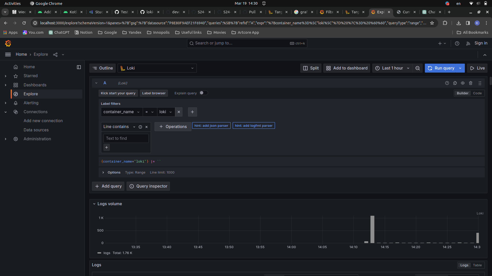
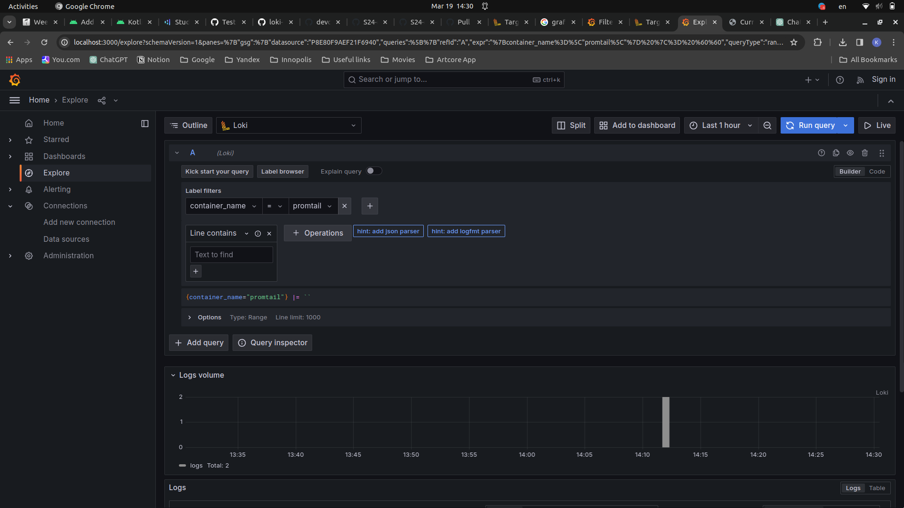
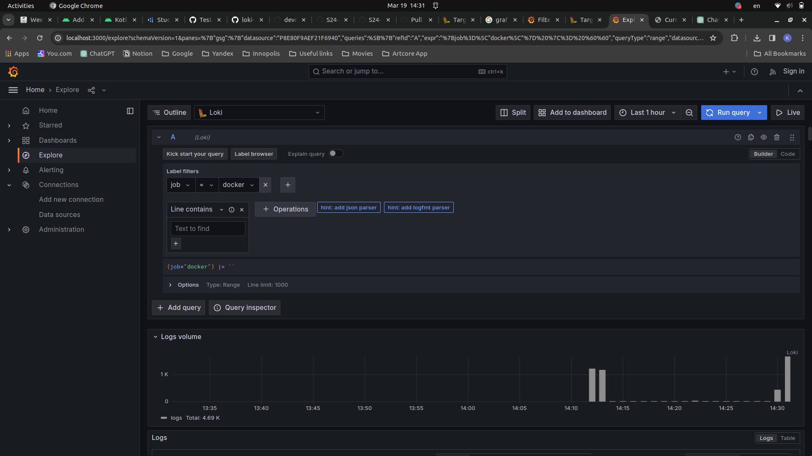
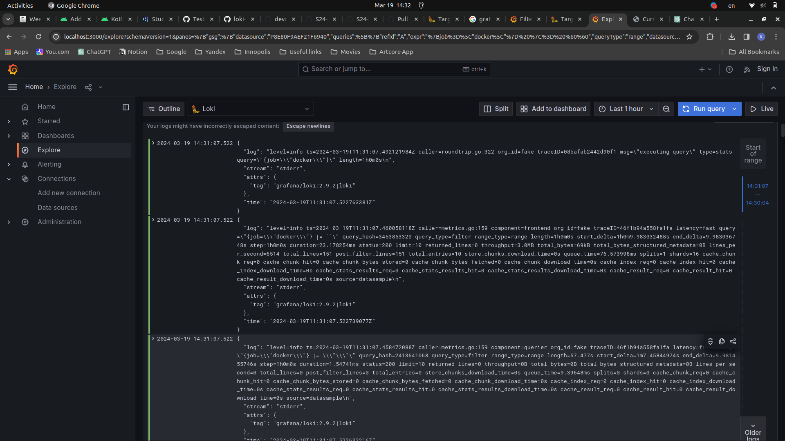

# Logging Stack Overview

## Components:

### 1. Grafana:
Grafana is a visualization tool that allows users to create and display real-time metrics and logs through customizable dashboards. It offers a user-friendly interface for monitoring and analyzing data from various sources.

### 2. Loki:
Loki is a horizontally-scalable, multi-tenant log aggregation system inspired by Prometheus. It is designed specifically for gathering, storing, and querying log data efficiently. Loki uses a highly efficient indexing mechanism to enable fast log queries without the need for extensive resources.

### 3. Promtail:
Promtail is an agent responsible for collecting and forwarding logs to Loki. It tailers log files, reads log streams, and sends them to Loki for storage. It supports various log formats and is highly configurable, allowing users to filter and process logs before they are sent to Loki.

## Functionality:

The logging stack functions as follows:

1. **Promtail Configuration:**
    - Promtail is configured to monitor specific log files generated by your web application and all other components. This configuration specifies which logs to collect, how to parse them, and where to forward them.
  
2. **Log Collection:**
    - Promtail continuously monitors the specified log files for changes or updates. As new log entries are generated by any of the containers, Promtail reads and collects them in real-time.
  
3. **Log Forwarding to Loki:**
    - Upon collecting log entries, Promtail forwards them to Loki, the central log aggregation system. Loki stores these logs in a highly efficient manner, optimizing storage space and query performance.
  
4. **Querying and Visualization with Grafana:**
    - Grafana connects to Loki as a data source, allowing users to query and visualize log data through Grafana dashboards. Users can create custom dashboards to monitor various metrics and logs, including the Moscow time displayed by the web application.

5. **Real-Time Monitoring:**
    - With this logging stack, it's possible to monitor all log data in real-time. They can set up alerts, analyze trends, and troubleshoot issues effectively using Grafana's powerful visualization capabilities.

## Running the logging stack

- Go to directory `monitoring`

- Run `docker-compose up`

- You can access Grafana at `http://localhost:3000`

- You can access Promtail at `http://localhost:9080`

## Screenshots

