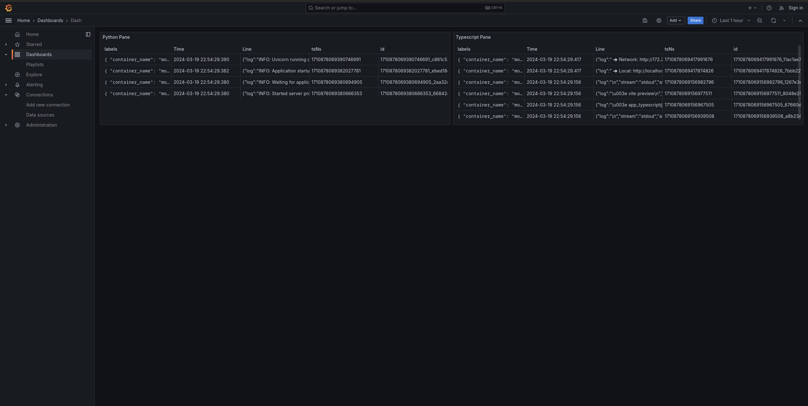
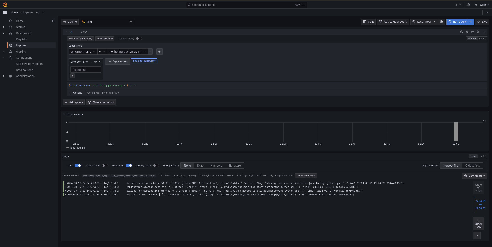
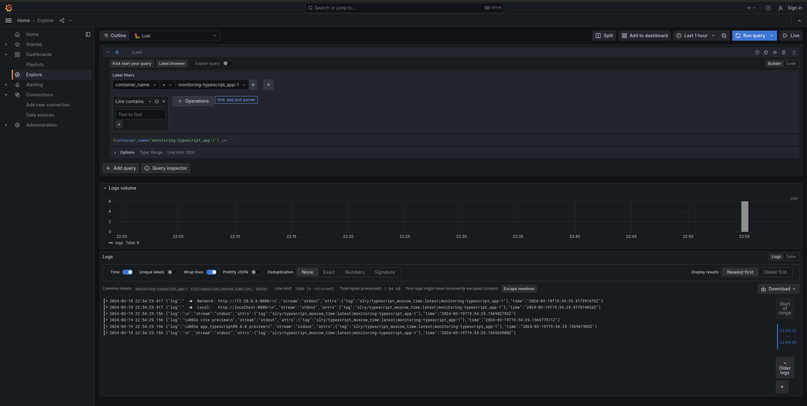

# Logging Stack Report

## Components Overview

### Promtail

Promtail is an agent that ships the contents of local logs to a private Loki instance.
Its primary role is to discover and tail log files, extract timestamp and metadata from them, and send them to Loki for storage and querying.

> Note: Config from [promtail.yml](https://github.com/black-rosary/loki-nginx/blob/master/promtail/promtail.yml) is used

### Loki

Loki is a horizontally scalable, highly available, multi-tenant log aggregation system inspired by Prometheus.
It indexes logs and makes them available for querying.
Loki does not index the contents of the logs, but rather a set of labels for each log stream.

### Grafana

Grafana is a multi-platform open-source analytics and interactive visualization web application.
It provides features to create, explore, and share dashboards, panels, and visualizations of log data from Loki.

### Screenshots

Below are screenshots demonstrating the successful operation of our logging stack:

1. Grafana Dashboard:
   

2. Python Loki Logs Query:
   
   
   Typescript Loki Logs Query:
   
