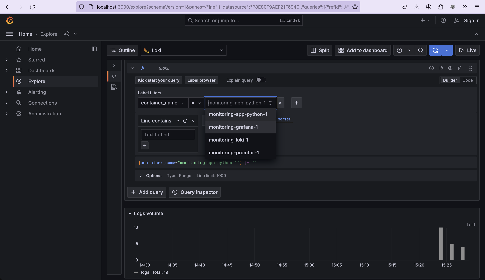
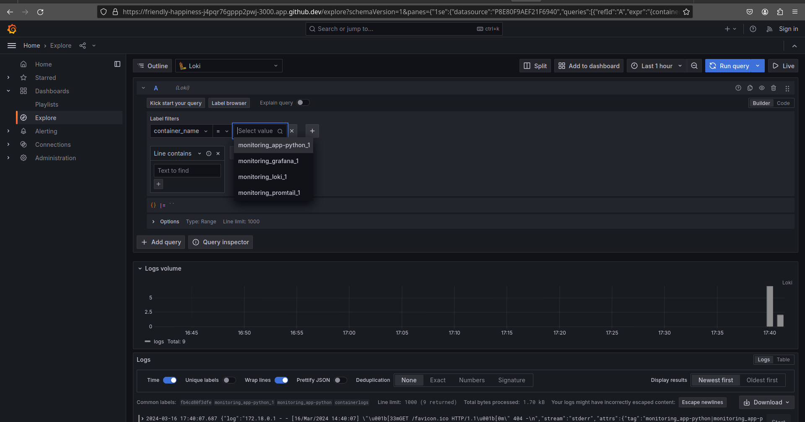

# Lab 7: Monitoring and Logging Overview

The monitoring and logging system comprises various interconnected components that work together to collect, aggregate, and display logs. Here is a breakdown of the key components and their functions:

### Log Collection Process

The logging process commences with Promtail collecting logs from Docker containers based on the specified paths. These logs are then forwarded to Loki for storage and indexing. Grafana interacts with Loki to retrieve log data and present it on customizable dashboards.

### Log Data Flow

The promtail.yml file configures Promtail to extract Docker logs from the local host, process them, and send them to a Loki server.

Logs from a Python application:

Additional Grafana Screenshots:

### Promtail

Function: Promtail is responsible for extracting logs from Docker containers and transmitting them to Loki.

Setup: The configuration of Promtail is defined in the promtail.yml file, specifying the Docker log paths and the Loki endpoint.

### Loki

Function: Loki serves as a scalable and fault-tolerant log aggregation platform.

Setup: Configuration settings for Loki are outlined in the docker-compose.yml file.

### Grafana

Function: Grafana offers an intuitive interface for log visualization and querying.

Setup: The configuration of data sources in Grafana is managed through docker-compose.yml.

