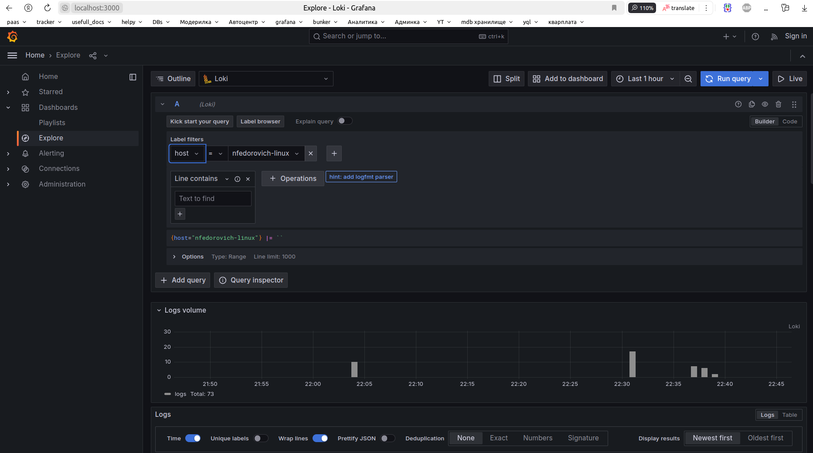
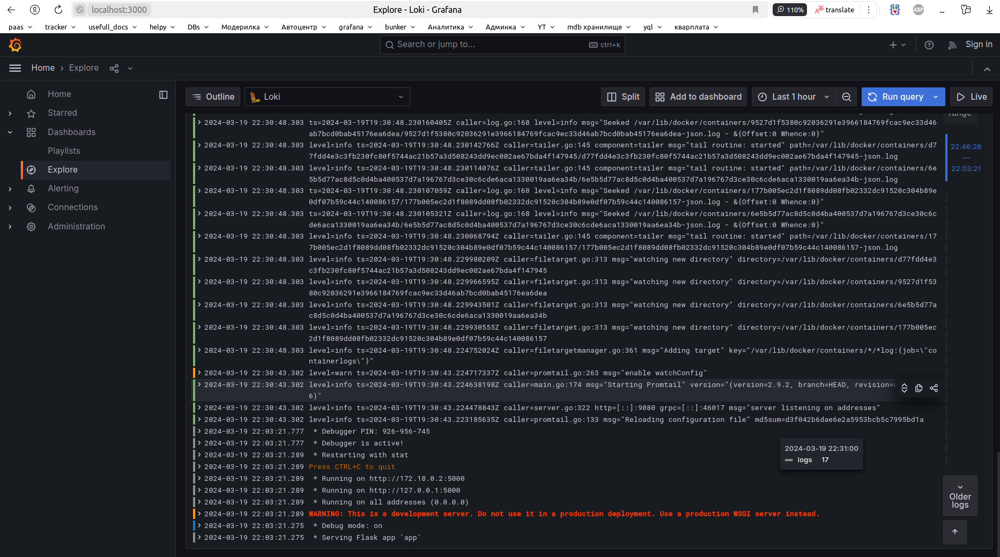

# Logging Stack Documentation

This documentation outlines the logging stack implemented in the provided Docker Compose file. The logging stack comprises the following components:

1. **Loki**: A horizontally scalable, highly available, multi-tenant log aggregation system inspired by Prometheus. It stores logs in a structured format and enables easy querying and analysis.

2. **Promtail**: A log shipping agent that collects logs from various sources, such as log files on disk or Docker container logs, and sends them to Loki for storage and analysis.

3. **Grafana**: A visualization and monitoring platform that integrates with Loki and allows users to create dashboards and alerts based on log data stored in Loki.

## Components Overview:

1. **Loki**:
   - **Purpose**: Loki serves as the central log storage backend. It receives log streams from Promtail agents and indexes them for efficient querying.
   - **Configuration**: Loki is configured with a `local-config.yaml` file, which specifies settings such as retention periods, storage configurations, and log format parsing rules.

2. **Promtail**:
   - **Purpose**: Promtail is responsible for collecting logs from various sources and forwarding them to Loki for storage. It tailors log streams from Docker container logs and log files on disk.
   - **Configuration**: Promtail is configured using the `config.yml` file. This configuration specifies which log files to scrape, the labels to attach to log streams, and the Loki endpoint to send logs to.

3. **Grafana**:
   - **Purpose**: Grafana provides a user interface for querying and visualizing log data stored in Loki. It allows users to create dashboards, set up alerts, and perform ad-hoc queries on log streams.
   - **Configuration**: Grafana's configuration is defined within the Docker Compose file. It includes settings such as data source provisioning for Loki, enabling anonymous access, and specifying the organization role for anonymous users.

## Workflow:

1. **Log Collection**:
   - Promtail agents running alongside application containers collect log streams generated by applications and Docker containers.
   - Promtail tailors these log streams according to configured rules, such as filtering by log file paths or adding labels based on container metadata.

2. **Log Shipping**:
   - Promtail ships the tailored log streams to Loki using HTTP push requests.
   - Loki indexes the incoming logs and stores them in a scalable, distributed storage backend.

3. **Data Visualization and Analysis**:
   - Grafana integrates with Loki as a data source, enabling users to query and visualize log data in real-time.
   - Users can create dashboards containing visualizations like logs, histograms, and trends, and set up alerts based on log stream patterns.

## Screenshots:

