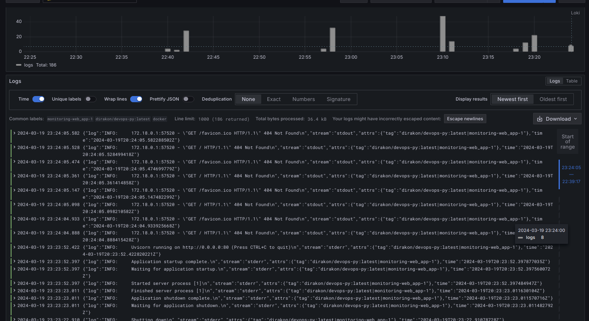
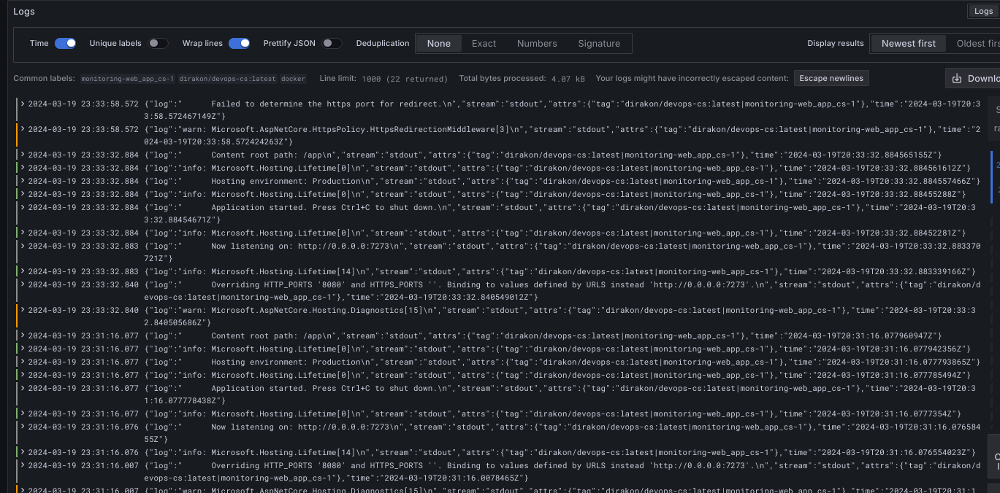

# Monitoring

## Description of services

### Loki

Backend for storing and searching logs.

### Promtail

Collects logs. In this specific scenario, it collects docker container logs, classifying them. Then it sends the logs to Loki.

### Grafana

App to review, view and analyzer logs from different sources. Has advanced frontend UI for these purposes.

## Usage

The services are connected via docker-compose and promtail config.

## Screenshots

Proof that all containers are monitored:

Main program logs:

Cs program logs:

