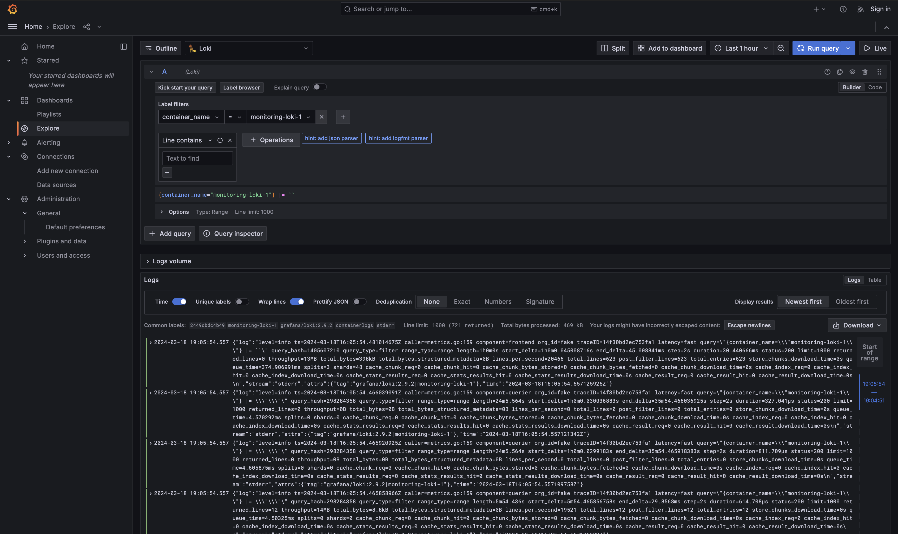
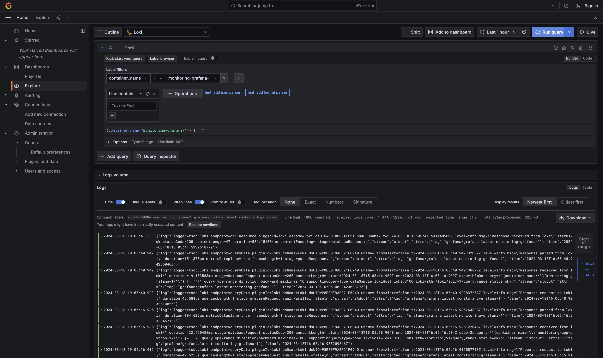
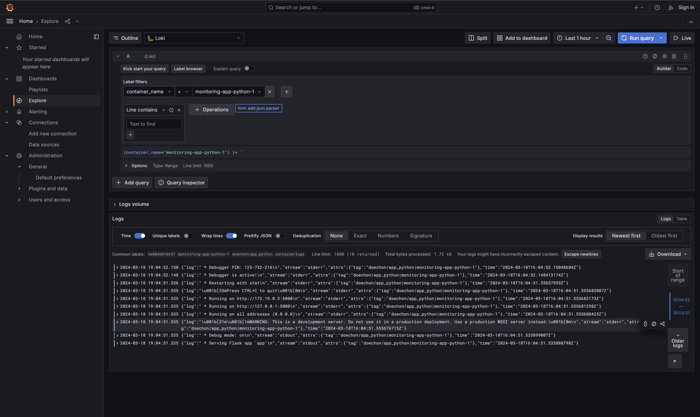
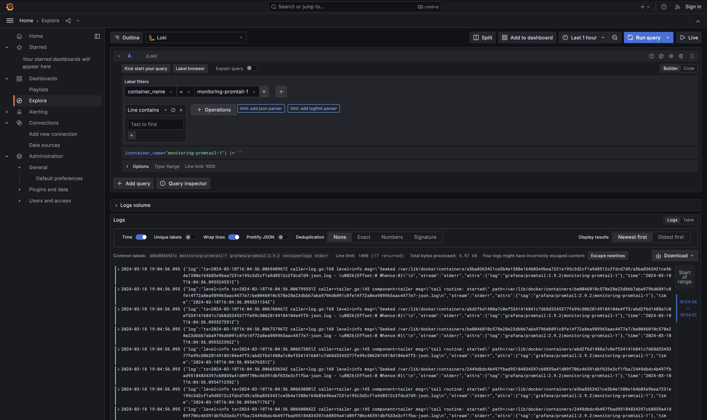
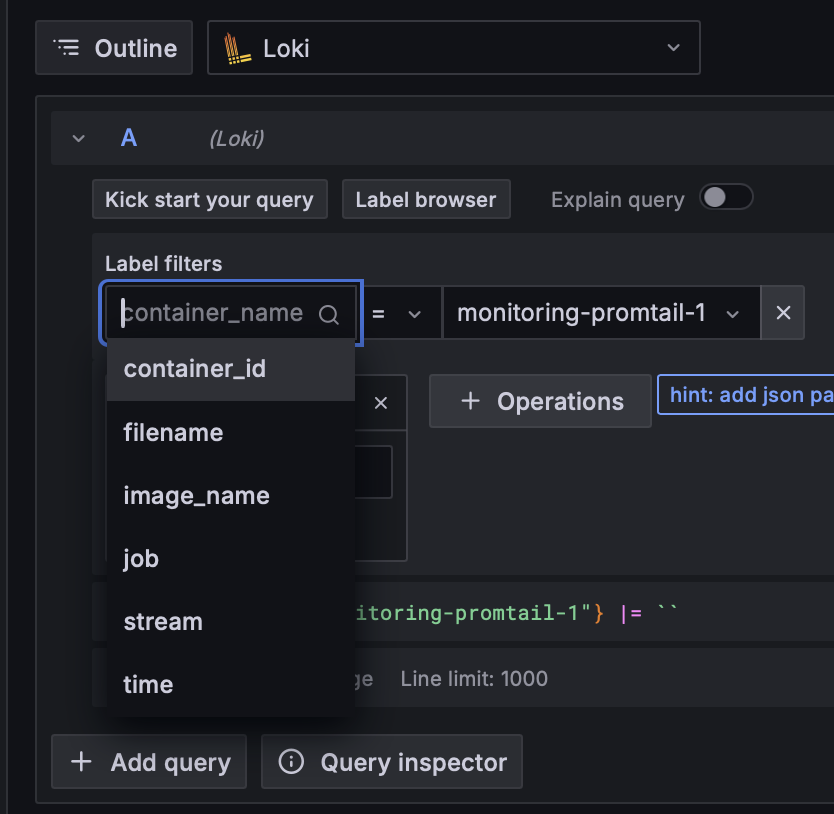
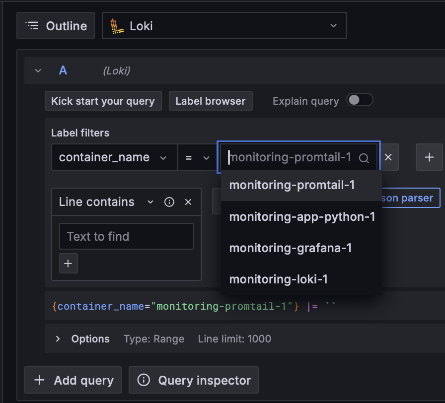

# Logging Stack Documentation

This documentation outlines the logging stack setup and its components. The logging stack is composed of Grafana Loki,
Promtail, Grafana and web app. The stack is designed to efficiently collect, aggregate, and visualize logs from various
sources
such as Docker containers.

## Components

### Grafana Loki

**Role**: Loki is a horizontally scalable, highly available log aggregation system inspired by Prometheus. It is
optimized for storing and querying logs.\
**Ports**: `3100:3100`\
**Usage**: Loki receives logs from Promtail agents, indexes them, and makes them available for querying via Grafana.

### Grafana

**Role**: Grafana is an open-source analytics and monitoring platform. It provides a web-based interface for querying,
visualizing, and alerting on metrics and logs. \
**Ports**: `3000:3000` \
**Usage**: Grafana connects to Loki as a data source, allowing users to create dashboards and explore logs stored in
Loki.

### Web app

**Role**: The Flask web application serves a webpage that displays the current time. It acts as the source of
application logs. \
**Ports**: `8000:5000` \
**Usage**: The Flask app generates logs containing information about HTTP requests, server responses, and any errors
encountered.

### Promtail

**Role**: Promtail is an agent that ships the contents of local logs to a Loki instance. It is typically deployed
alongside applications running on Kubernetes or Docker. \
**Usage**: Promtail collects logs from Docker containers, adds metadata, and forwards them to Loki for storage and
indexing.

## Additional Screenshots

### Acceptable labels

