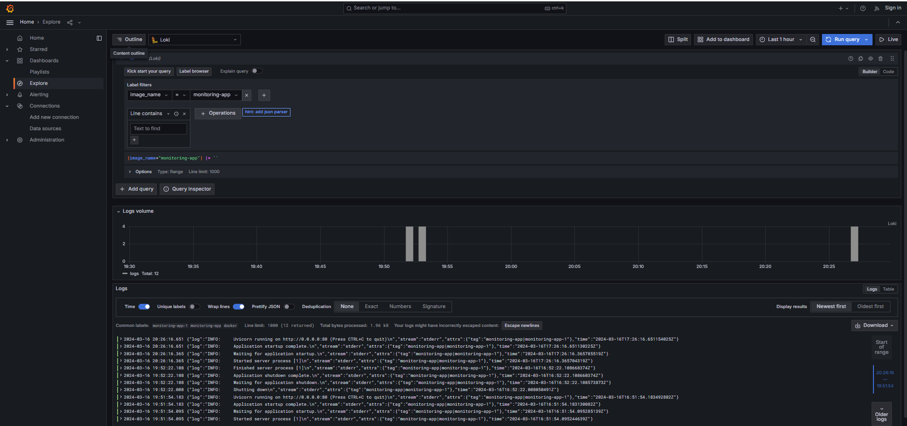
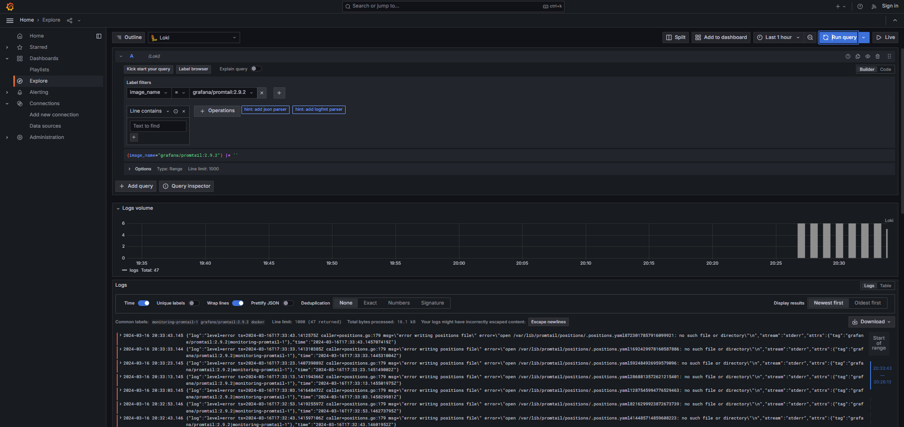
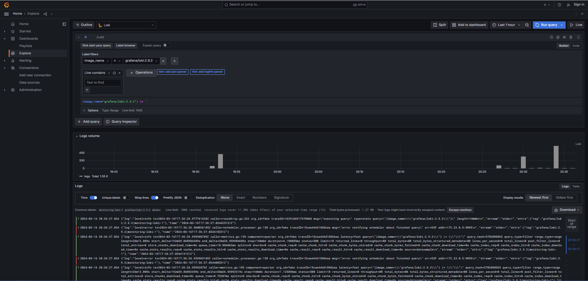
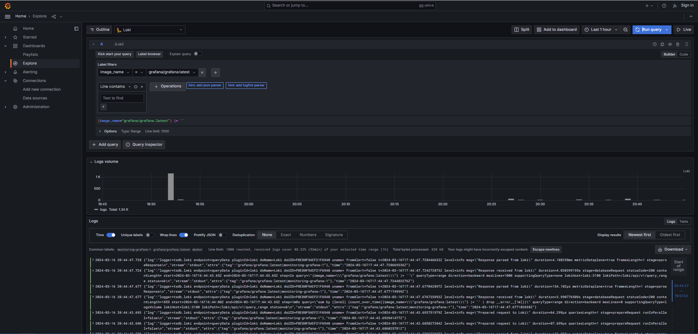

# Logging

The monitoring and logging is done through connection of separate instruments like loki, promtail and grafana. Each of
these components has its specific role.

## Flow description

The logging starts with Promtail tool, which collects the logs following the rules in promtail.yml. Then the logs are
stored and indexed in Loki. The visualization tool Graphana uses these logs from Loki and helps us to track and
visualize them.

### Log Data Flow

The promtail.yml file configures Promtail to extract Docker logs from the local host, process them, and send them to a
Loki server.

## Moscow time application

### Description

This is the main compoment in our system that is being observed.

### Logs

### Promtail

### Description

This is the component that is responsible for collecting logs from all the sources described in promtail.yml. It is used
as source for Loki.

### Logs

### Loki

### Description

This is compoment that plays a role of log database. It collects logs from the promtail, stores and indexes it.

### Logs

### Grafana

### Description

This is compoment that visualizes the logs that comes to it from different sources. In our case it serves the logs that
comes from Loki.

### Logs

