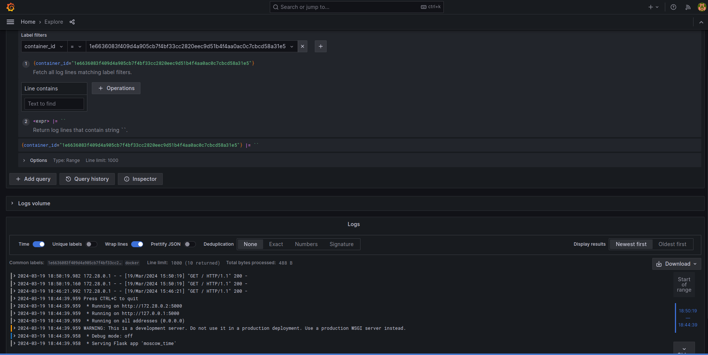
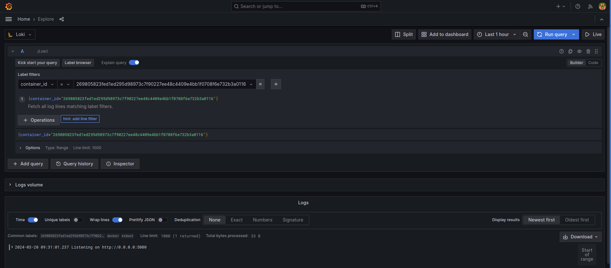

# Grafana+Loki+Promtail logging

## Components

**Promtail** is a log agent. It collects local logs and sends them to Loki.

**Loki** is a log aggregation system. It collects logs from agents and,
based on them, builds metrics, generates alerts, and integrates with other
tools, such as Grafana.

**Grafana** is a web tool, which in this setup allows for querying and viewing
logs aggregated by Loki.

## Process

Here is what happens to logs:

1.  Logs of docker containers are written into log files by `dockerd`.

2.  Promtail collects new lines written into files.

3.  Promtail processes logs according to the configured pipeline: extracts
    and labels the `container_id` according to the file name, parses the
    json format of `dockerd`, removes ASCII color codes.

4.  Promtail pushes logs to Loki.

5.  User makes a request in Grafana, which queries Loki and returns the matching
    log lines.

## Screenshots

