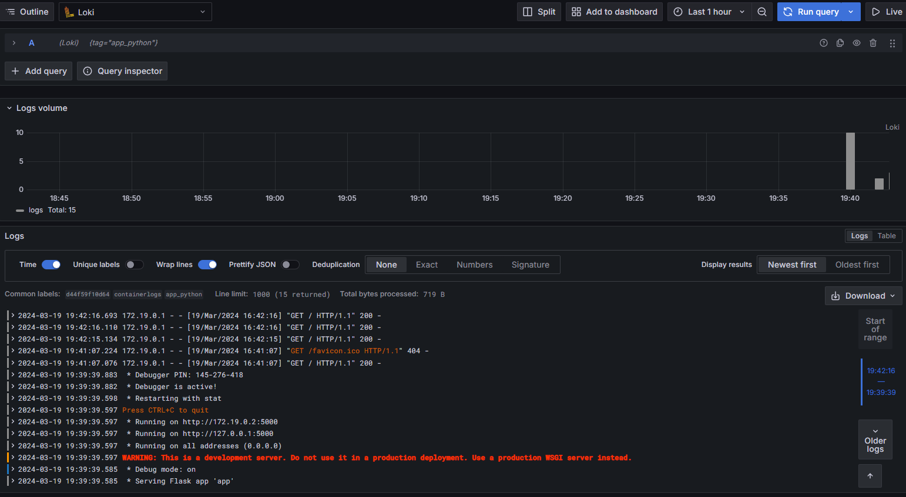

# Promtail
- Discovers ond processes all containers logs
- Categorizes logs
- Send logs to loki

# Loki
- Stores logs
- Provides search engine

# Grafana
- Provides UI for sendind queries to loki and observing results

# Screenshots

## app_python

## all containers
