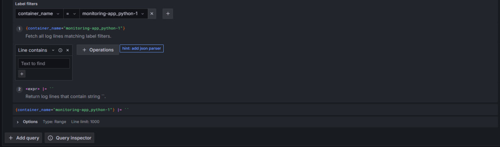
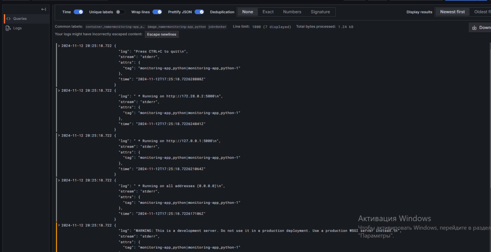
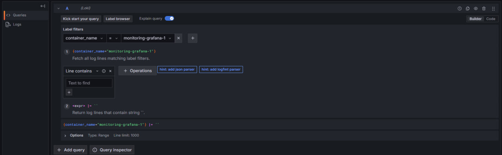
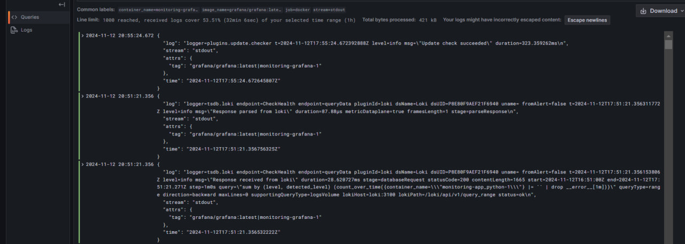
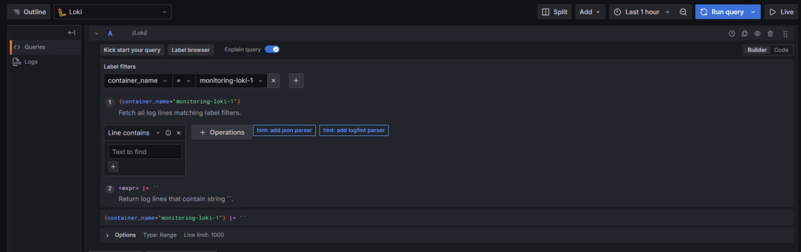
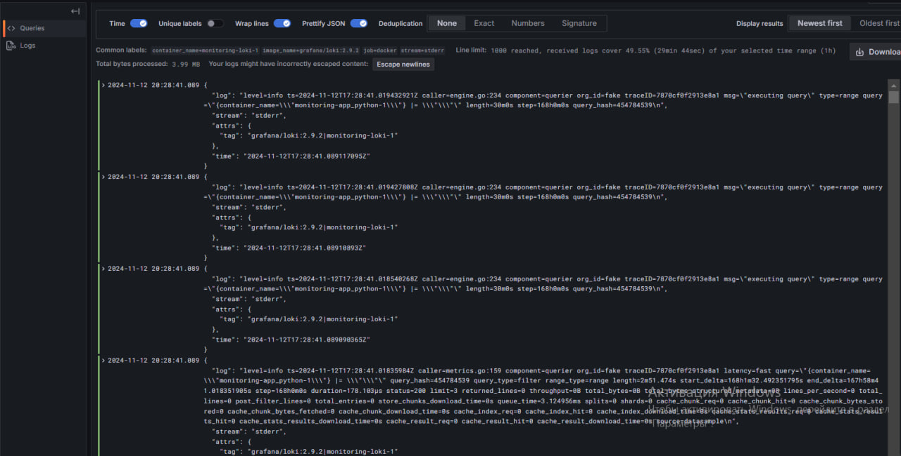
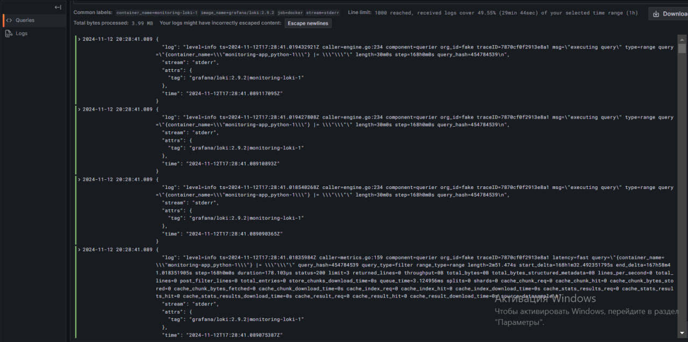

# Logging Stack Documentation

## Components Overview

### 1. **Grafana**
Grafana is a popular open-source platform for monitoring and observability. In the context of the logging stack, Grafana is used for visualizing logs stored in Loki.

#### Role:
- **Visualization**: Grafana provides an intuitive interface to query and visualize logs.
- **Dashboard**: It allows the creation of custom dashboards to monitor logs in real-time and can integrate with other data sources.
- **Configuration**: Grafana is configured to connect to Loki as a data source, enabling it to pull logs and present them in a user-friendly manner.

### 2. **Loki**
Loki is a log aggregation system designed to efficiently store and query logs. It is optimized for indexing and searching logs, but unlike traditional log systems, it doesn't index the full content of logs, just metadata like time and labels. Loki integrates seamlessly with Grafana for querying and visualization.

#### Role:
- **Log Aggregation**: Loki collects logs from different sources (in this case, from Promtail) and stores them in a highly optimized format.
- **Querying**: It provides a querying interface, which Grafana uses to retrieve logs based on specific labels or time ranges.
- **Efficient Storage**: Loki is designed to scale efficiently and handle large volumes of log data with minimal overhead.
 
### 3. **Promtail**
Promtail is an agent that collects logs from containers (or other sources) and sends them to Loki. It is responsible for discovering logs and shipping them to Loki in the correct format.

#### Role:
- **Log Collection**: Promtail tailors log files (such as Docker container logs) and sends them to Loki.
- **Log Parsing**: It is capable of parsing logs using different stages such as JSON parsing, regex matching, and timestamp extraction.
- **Log Shipping**: Promtail pushes logs to Loki via its HTTP API, ensuring that logs from multiple sources are sent in a standardized format.

## Key Benefits

- **Real-time Monitoring**: This stack provides near real-time visibility into application logs, helping teams quickly identify and respond to issues.
- **Scalability**: With the efficient storage model of Loki, the stack can scale to handle large volumes of logs.
- **Centralized Logging**: Grafana provides a centralized platform for monitoring and querying logs across multiple containers and services.
- **Easy Integration**: The stack integrates seamlessly with Docker, Promtail, Loki, and Grafana, allowing for a flexible and scalable logging solution.

## Troubleshooting

- **Grafana Not Displaying Logs**: Ensure that Grafana is correctly connected to Loki by verifying the data source configuration in the Grafana UI. Check if the logs are being correctly ingested into Loki.
- **Promtail Not Collecting Logs**: Check the Promtail logs for any errors related to file access or permissions. Ensure that the file paths in the Promtail configuration are correct and the position file is properly managed.
- **Loki Querying Issues**: If queries return no results, check that Loki is correctly receiving logs from Promtail. Ensure that the log labels and time range specified in the query match the logs being sent.

## Sreenshots

Container name: monitoring-app_python

Container name: monitoring-grafana

Container name: monitoring-loki

Container name: monitoring-promtail

