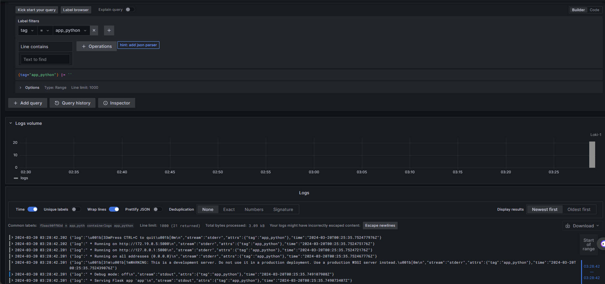
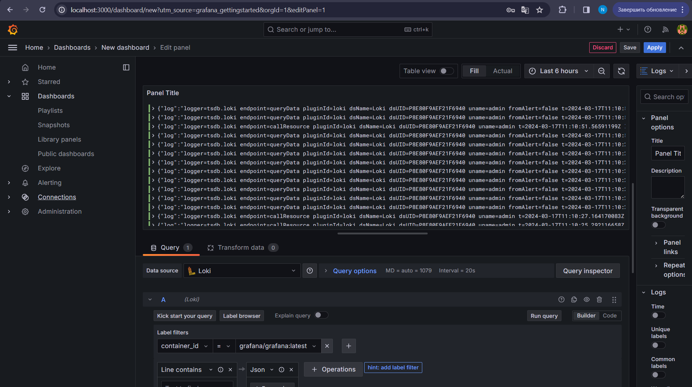
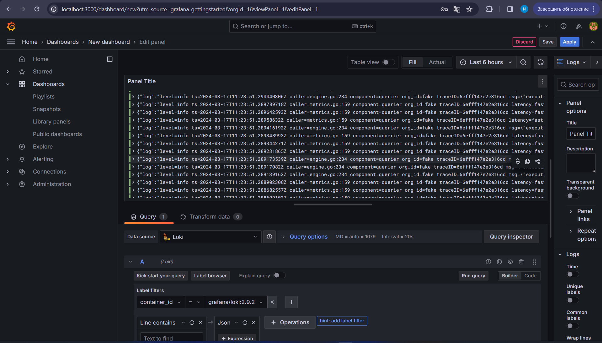

# Logging Stack Report

## Overview

In this report, I will provide a detailed explanation of the logging stack

## Docker Compose YML File

The Docker Compose file consists of four services: app_python, loki, promtail, and grafana. These services work together to create a functional logging stack.

### app_python service

Role: Runs the Python application that generates log entries.
Docker Image: hugowea123/devops-labs-py:correct
Port Mapping: Binds port 5000 of the container to port 5000 of the host machine.
Networks: Connects to the loki network.
Logging Driver: Uses the json-file logging driver with the tag "app_python".

### loki service

Role: Horizontally scalable, highly available log aggregation system.
Docker Image: grafana/loki:2.9.2
Port Mapping: Binds port 3100 of the container to port 3100 of the host machine.
Command: Specifies the configuration file /etc/loki/local-config.yaml.
Networks: Connects to the loki network.
Logging Driver: Uses the json-file logging driver with the tag "loki".

### promtail service

Role: Log agent responsible for tailing log files, enriching them with metadata, and forwarding to Loki.
Docker Image: grafana/promtail:2.9.2
Volumes: Mounts the promtail.yml configuration file and the host's /var/lib/docker/containers directory to /etc/promtail/config.yml and /var/lib/docker/containers inside the container, respectively.
Command: Specifies the configuration file /etc/promtail/config.yml.
Networks: Connects to the loki network.
Logging Driver: Uses the json-file logging driver with the tag "promtail".

### grafana service

Role: Analytics and visualization platform for querying and visualizing logs stored in Loki.
Docker Image: grafana/grafana:latest
Environment Variables: Sets up environment variables for Grafana's configuration.
Entrypoint: Executes a shell script to configure Grafana's provisioning for the Loki data source and starts Grafana.
Port Mapping: Binds port 3000 of the container to port 3000 of the host machine.
Networks: Connects to the loki network.
Logging Driver: Uses the json-file logging driver with the tag "grafana".

## Promtail Configuration

The provided promtail.yml file contains the configuration for the Promtail service. It defines how Promtail collects, enriches, and forwards logs to Loki.

- server section: Specifies the HTTP and gRPC listener ports for Promtail.

- - http_listen_port: Port 9080 is configured for HTTP communication.
- - grpc_listen_port: Port 0 means the gRPC server listens on any available port.

- positions section: Specifies the filename and location for storing the positions of log files being scraped.

- clients section: Defines the Loki server URL where Promtail should forward the logs.

- scrape_configs section: Specifies the log scraping configurations.
- - job_name: Identifies the job as "containers".
- - static_configs: Defines the targets and labels for log scraping.
- - - targets: Specifies the target as "localhost".
- - - labels: Sets the job label as "containerlogs" and defines the log file path as /var/lib/docker/containers/*/*log.
- - pipeline_stages: Specifies the stages of log processing, such as JSON parsing, regex matching, labeling, and output.
- - - json stage: Extracts fields from the log entry using JSON expressions.
- - - regex stages: Matches regular expressions against the log file name and log tags to extract container-specific details.
- - - labels stage: Assigns extracted values to labels for better log searchability and analysis.
- - - output stage: Specifies the output source as "log".

## Screenshots

