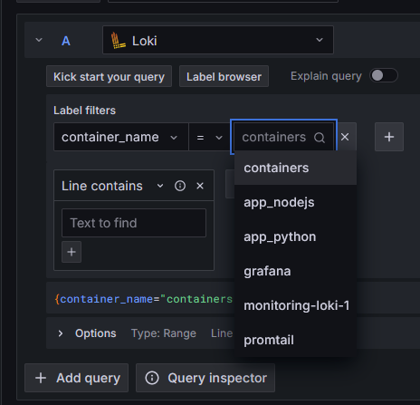
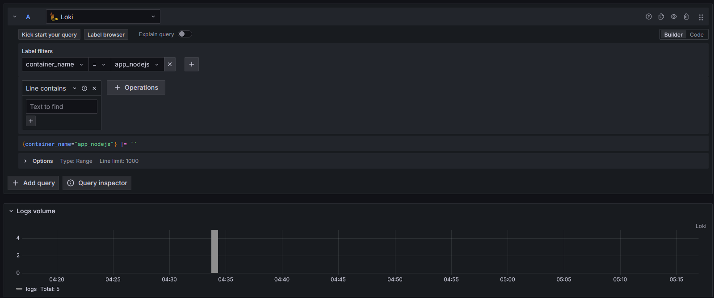
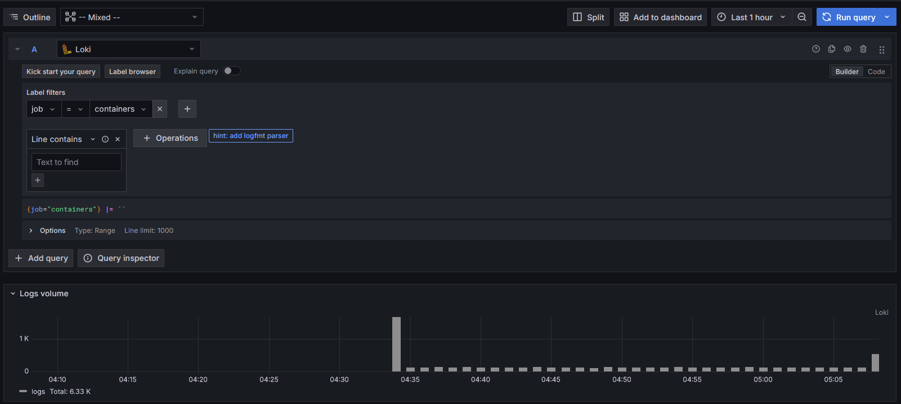

# Logging stack

## Setup
Set up the logging stack using `docker compose up`

## Grafana
- Access log data using user-friendly web-interface, cooperate with Loki,
it can connect to different sources, connect data via multithreading and visualize them via building complex monitoring panels.
- Connect using `http://localhost:3000`

## Loki 
- Loki is a log aggregation system designed to store and query logs from all your applications and infrastructure. Inspired by Prometheus
- Available to Grafana inside Docker at `http://loki:3100`

## Promtail
- Promtail is an agent which ships the contents of local logs to a private Grafana Loki instance or Grafana Cloud. It is usually deployed to every machine that runs applications which need to be monitored. It primarily: discovers targets, attaches labels to log streams, pushes them to the Loki instance.

This logging stack is composed of several components, they are work together to collect, store, and visualize logs from various services running within a Docker environment. The stack uses `Grafana Loki` as a centralized log aggregation system, with `Promtail` as the agent for shipping logs to `Loki`, and `Grafana` for visualizing the logs. 

The `docker-compose.yml` file defines the configuration for deploying these components with web service.

## Results observation
- The deployed containers are available in a query
    
- Python application (shows some requests)
    
- NodeJS Application
    
- Grafana
    
- Loki
    
- Promtail
    
- All docker containers

    Select all deployed containers by selecting job as a filter, 'job' value should be equal to 'containers'
    
