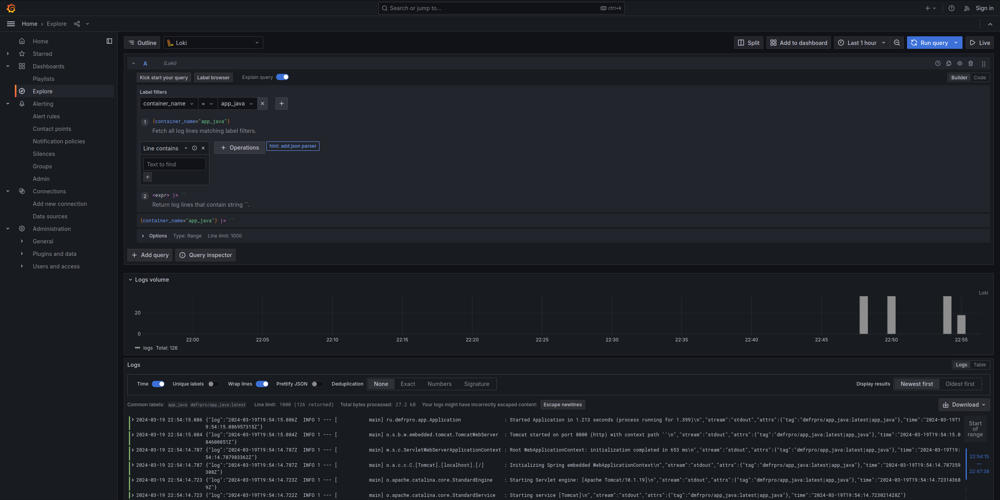

# Monitoring

## Grafana

Grafana is an open-source data visualization and monitoring tool that allows
users to create interactive dashboards and visualize various metrics and data
sources in real-time. It provides a user-friendly interface for monitoring and
analyzing data from different sources.

## Loki

Loki is a horizontally-scalable, multi-tenant log aggregation system that is
designed to be used with Grafana. It helps collect, store, and search logs from
various sources, making it easier to troubleshoot issues and gain insights from
log data.

## Promtail

Promtail is a log agent that is used to scrape logs and send them to Loki for
storage and analysis. It acts as a bridge between the log files and Loki,
allowing logs to be collected and processed efficiently. Its purpose is to
ensure that logs are collected and sent to the centralized log system for
further analysis and monitoring.

## Screenshots

### app_python

### app_java

### grafana

### loki

### promtail

