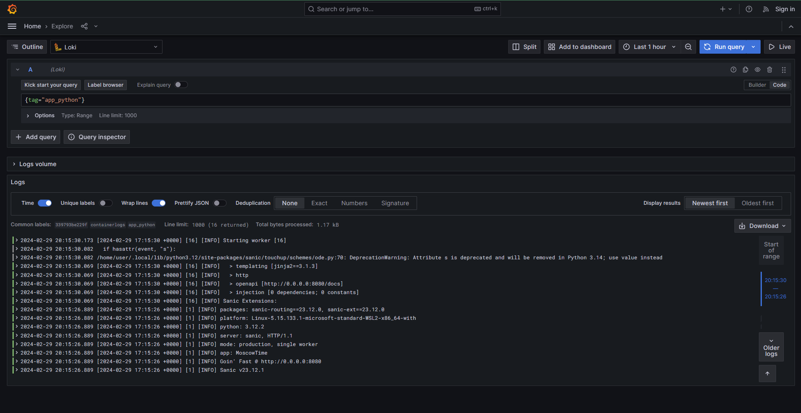
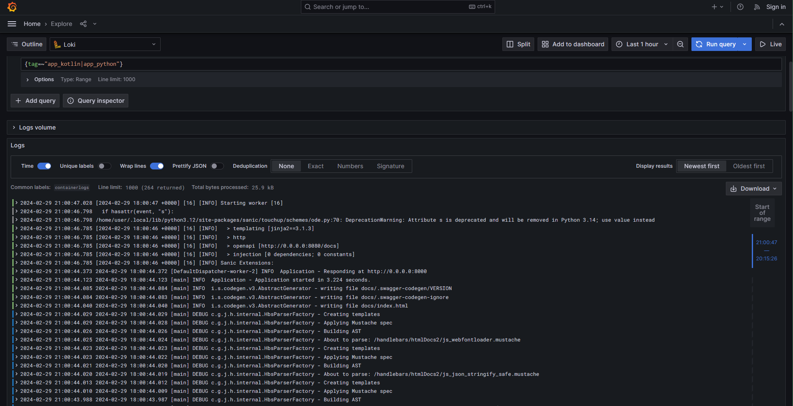
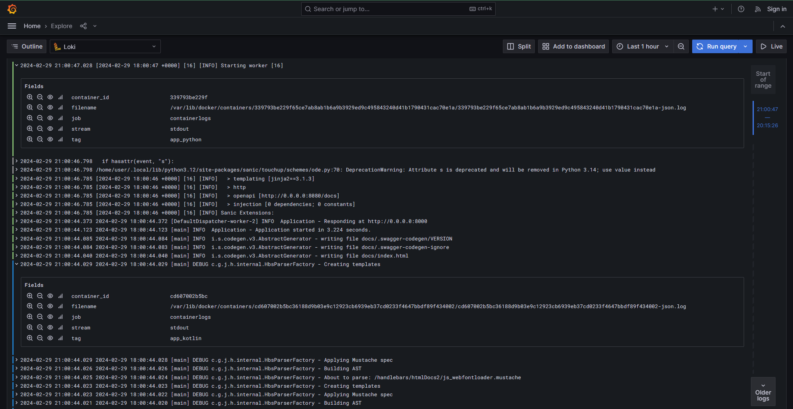

# Logging

## Components

- `Promtail`
  - Discovers log files (all containers logs)
  - Processes log streams (decomposes json-logs and filters them)
  - Attaches labels to streams (according to fields in json)
  - Pushes logs to Loki
- `Loki`
  - Aggregates and stores logs
  - Processes queries
- `Grafana`
  - Builds queries and sends them to Loki
  - Displays query results

## Screenshots

### Only `app_python`

### Both `app_python` and `app_kotlin`

