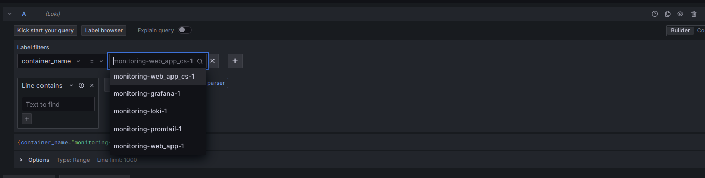
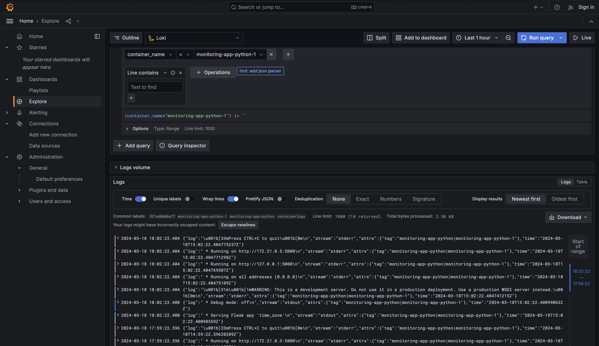
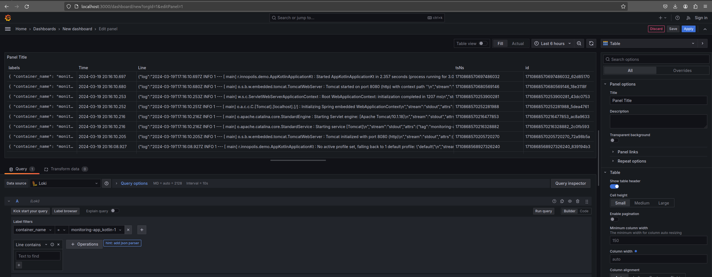

# Logging Stack Documentation

## Components

### Grafana

- Role: Grafana is a visualization tool that allows you to create dashboards and visualizations based on data from various sources, including logs.
- Function:
  - Visualize the data
    - Accessible on port 3000
    

### Loki

- Role: Loki is a log aggregation system that stores and indexes logs for easier searching and analysis
- Function:
  - Stores the logs
    - Accessible on port 3100
    

### Promtail

- Role:  Promtail is the agent used to collect and send log data to Loki for storage and analysis.
- Function:
  - Collects logs and sends them to loki
    - Accessible on port 9080
    

### Apps (app_python, app_kotlin)

- Role: These apps gives endpoints for aquiring current time
- Function:
  - All logs are written in stdout
    - Apps are in Loki network, so it can collect their logs
    
    
