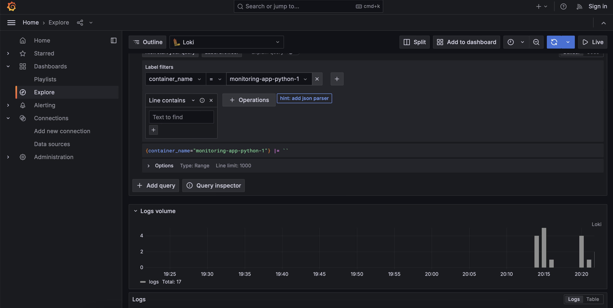

# Documentation on Logging Infrastructure

This document details the setup and elements of our logging infrastructure, crafted to offer a comprehensive logging solution for overseeing and resolving issues within our applications.

## Components Overview

### 1. Loki

Loki serves as a scalable, reliable log aggregation system supporting multiple tenants. It focuses on cost-efficiency and ease of operation by not indexing log contents but rather utilizing labels for log streams.

Within our infrastructure, Loki is integrated as a service in our docker-compose.yml file. It manages the storage of logs gathered by Promtail and allows querying through Grafana.

- Image: grafana/loki:2.9.2
- Configuration: Utilizes a configuration file at /etc/loki/local-config.yaml within the container, following the command specified in the docker-compose setup.
- Port: Accessible on 3100 for log reception and queries.

### 2. Promtail

Promtail acts as an agent responsible for forwarding local log data to a Loki instance or Grafana Cloud. It monitors specific directories for logs, captures metadata (like labels), and transmits this data to Loki.

- Image: grafana/promtail:2.9.2
- Configuration: Outlined in promtail.yaml, it designates Loki as the log destination at http://loki:3100/loki/api/v1/push. Promtail gathers logs from /var/lib/docker/containers/*/*log, enriches them with metadata, and sends them to Loki.
- Volumes: Links promtail.yaml to the container's /etc/promtail/config.yml and connects the host's Docker container logs directory to the container for log collection.

### 3. Grafana

Grafana stands as an open-source platform catering to monitoring and observability needs. It empowers users to query, visualize, set alerts, and comprehend metrics stored across various locations.

- Image: grafana/grafana:latest
- Configuration: Grafana is configured using environment variables and an entrypoint script that generates a datasource configuration file for Loki, establishing it as the primary data source.
- Port: Accessible via 3000, enabling users to interact with the Grafana UI for log queries and visualization.

### 4. Application Service (app-python)

This service exemplifies an application that produces logs collected by our infrastructure. It showcases how logs from any service in the setup can be directed to Loki via Promtail for storage and analysis.

- Image: nabuki/moscowtime-web:latest
- Ports: Maps port 8000 on the host to 8080 on the container, making the application externally reachable.
- Logging: Set up to use the default logging driver, streamlining log collection by Promtail.

## Logging Operations

The functionality of our logging infrastructure is illustrated through a screenshot captured at screenshots/app.png, displaying the successful gathering and visualization of logs from our application service in Grafana.

This configuration guarantees efficient collection, storage, and centralized accessibility of service logs, offering valuable insights for monitoring and issue resolution purposes.