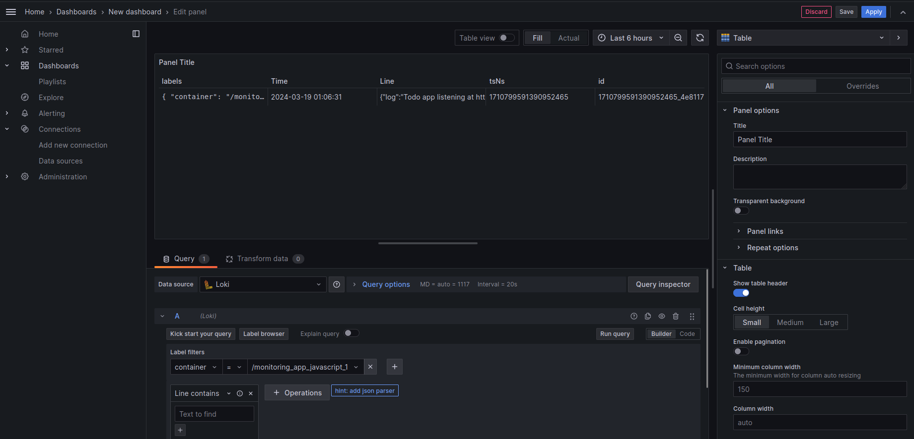

# Logging 

## Components

### Grafana

Grafana shows logs collected by Loki and makes it easy to understand them. It connects to Loki automatically, so there's no need for manual setup.

- **Role**: Used for looking at and studying logs.
- **Setup**: Set to include Loki by itself, and accessible via port `3000`.

### Loki

Loki stores logs efficiently, focusing on indexing log labels for better performance.

- **Role**: Keeps logs sent by Promtail.
- **Setup**: It runs in Docker, using a command that points to a configuration file. This file explains how Loki should work, such as where to keep logs and how to sort them. It's accessible via port `3100`, with labels `image_name` and `container`.

### Promtail

Promtail gathers logs and sends them to Loki.

- **Role**: Collects and sends logs.
- **Setup**: Its setup is in a `promtail.yml` file, showing where to get logs and how to ready them for Loki. In this setup, Promtail is made to get logs from Docker containers, including `app_python` and `app_javascript` services, and send them to Loki. Accessible via port `9080`.

## Applications

### app_python and app_javascript

Both are set to be built from the folders (`../app_python` and `../app_javascript`) and show their services on different ports. They are both part of the `loki` network.

- **Role**: They create logs that are watched.
- **Setup**: Each app is set up in the Docker Compose file with its build area, ports, and log setups.

## Log Settings

- **Log Driver**: Uses Docker's JSON-file driver, customized for log rotation.
- **Log Structure**: Logs are structured in JSON format.
- **Labels**: Log messages come with labels for both the image and container names.

## Screenshots 
### Grafana

### Loki 

### Promtail 

### app_python 

### app_javascript 
