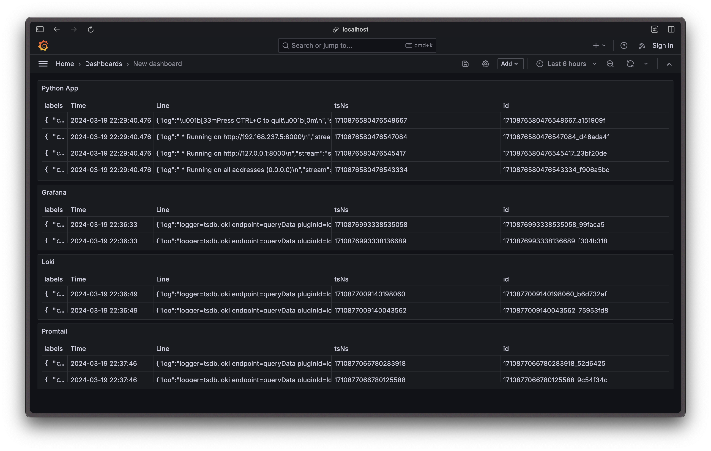

# Monitoring

## Logging

### Stack Description

`docker-compose.yml` has 4 services:

1. `python_app` — the Moscow time python application. Docker image is pulled from Docker Hub, where I pushed my image.
   - App writes logs to `stdout` and `stderr`.
   - App is accessible on `localhost:8000`.
2. `grafana` — Grafana server, which is used for visualization of logs, connecting to data sources and creating dashboards.
   - Grafana is accessible on `localhost:3000`.
   - It automatically connects to Loki as a data source.
3. `loki` — Loki server, which is used for storing logs.
   - Loki is accessible on `localhost:3100`.
4. `promtail` — Promtail agent, which is used for scraping logs and sending them to Loki.
   - It is mounted with the `promtail-config.yml` configuration file, which includes necessary ports, pipeline stages, and labels. It parses Docker logs, which have tag in format `<ImageName>|<Name>`, so they then are accessible in Grafana.

### Screenshot

