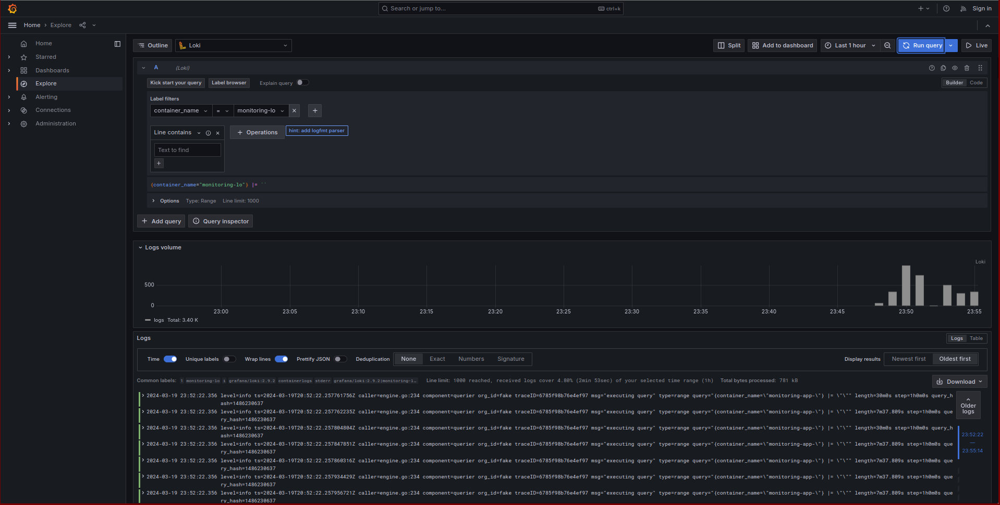
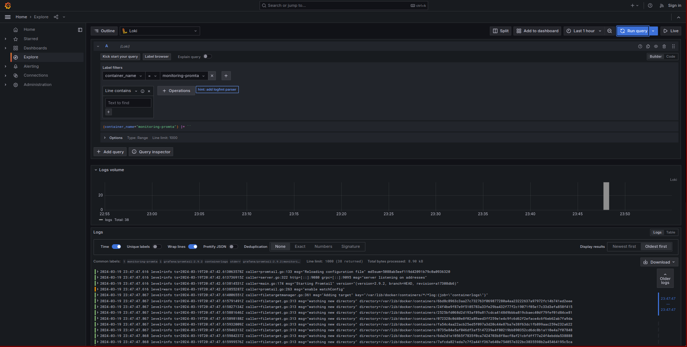
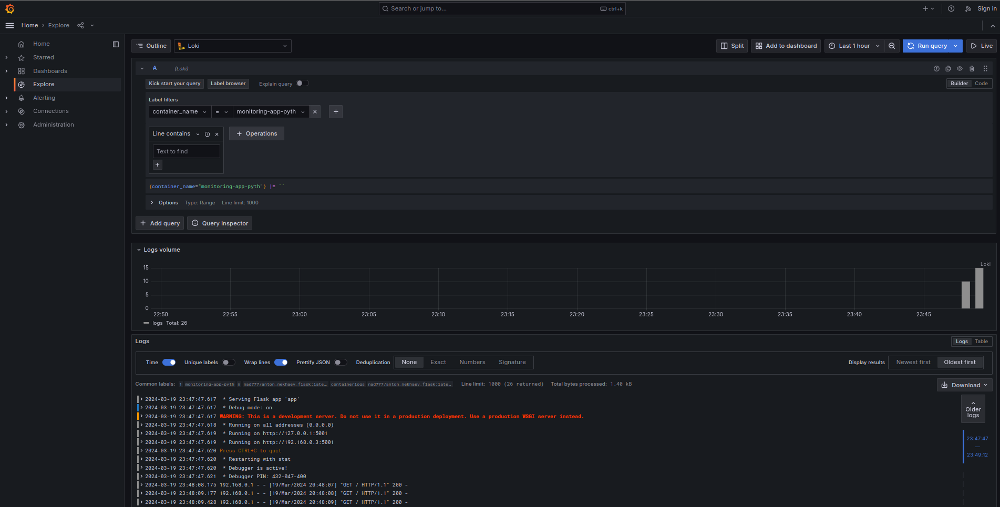
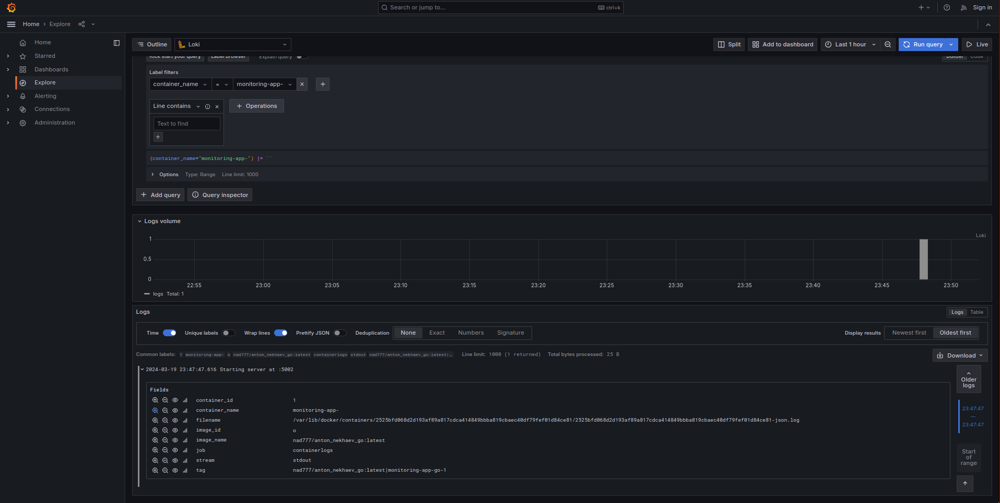
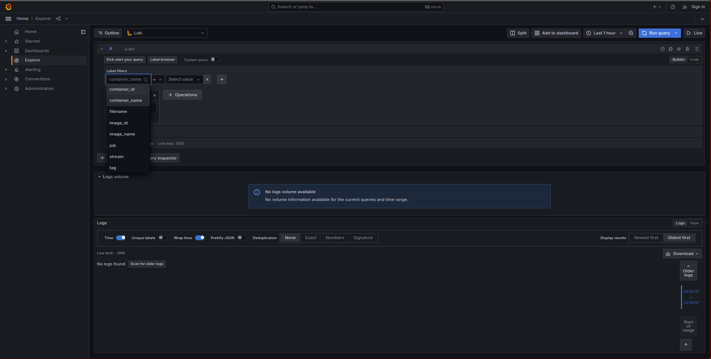

# Logging Stack Documentation

## Overview

This document outlines the setup and functionality of our logging stack, which consists of Grafana, Loki, and Promtail. This stack is designed to collect, aggregate, and visualize logs from our application, providing insights into its behavior and performance.

## Components

### Grafana

**Role**: Grafana serves as the visualization layer of our logging stack. It provides a user-friendly web interface to query and visualize logs collected by Loki. Grafana supports creating dashboards that can display data from various sources, making it an excellent tool for monitoring application logs and metrics in real-time.

### Loki

**Role**: Loki is a horizontally-scalable, highly-available, multi-tenant log aggregation system inspired by Prometheus. It's designed to be cost-effective and easy to operate. Unlike other logging systems, Loki indexes only metadata about the logs, such as labels (similar to Prometheus labels), which makes it efficient and fast for querying logs based on their metadata.

### Promtail

**Role**: Promtail is the agent responsible for collecting and shipping logs to Loki. It tails logs files, typically from applications and services running on the same machine, and forwards them to Loki. Promtail uses service discovery to automatically find and monitor log files, enriching them with metadata before sending them to Loki.

### App Python

### App Go

### Label filters

## Conclusion

This logging stack provides a robust solution for monitoring and analyzing logs from our application. By leveraging the combined capabilities of Grafana, Loki, and Promtail, we can gain valuable insights into our application's performance and troubleshoot issues more effectively.

