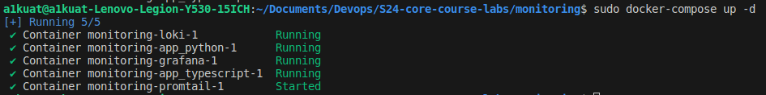
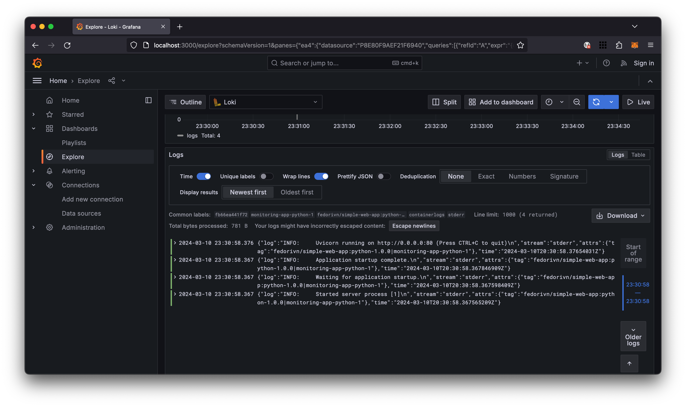
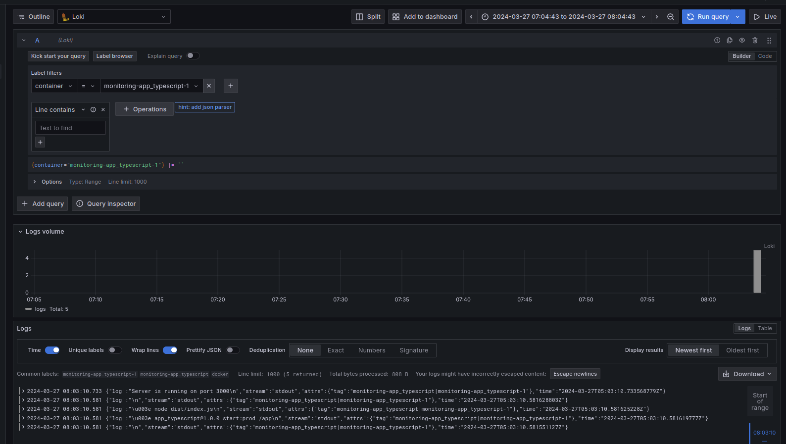

# Monitoring

## Description of services

### Loki

Loki is responsible for storing and querying the logs collected by Promtail. It acts as the central repository for log data, allowing for efficient search and retrieval of logs.

### Promtail

Promtail is responsible for collecting logs from the specified sources and forwarding them to Loki. It is configured to scrape logs from the Docker containers running our applications (app_python and app_typescript) and the host's log files.

### Grafana

Grafana is used to visualize the logs collected and stored by Loki. It provides a user-friendly interface for querying and exploring log data.

## App_Python and App_Typescript

Both applications generate logs that are collected by Promtail and stored in Loki. These logs can then be queried and visualized in Grafana.

## Screenshots

### Docker-compose of all containters:

### Monitor python-app:

### Monitor typescript-app:

