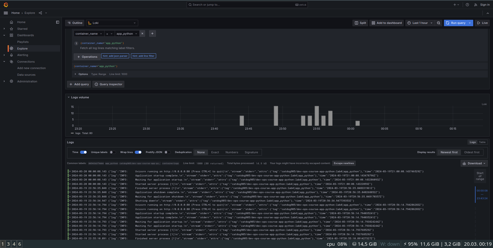
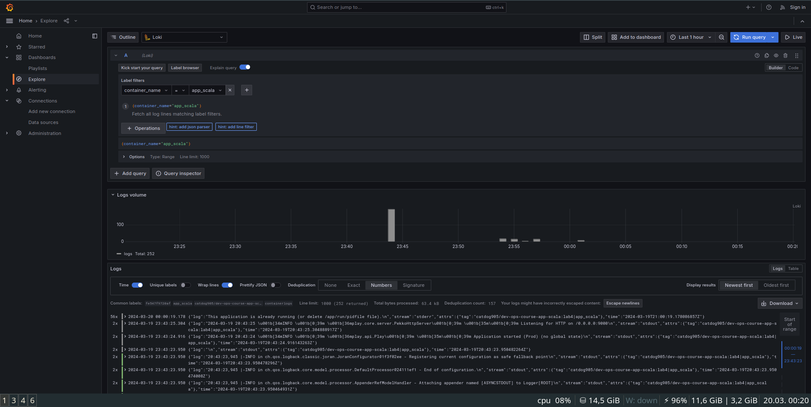

# Monitoring

## Grafana

Grafana is a multi-platform open source analytics and interactive visualization web application. It provides charts, graphs, and alerts for the web when connected to supported data sources. 

## Loki

Loki is a horizontally scalable, highly available, multi-tenant log aggregation system inspired by Prometheus.

I've copied docker-compose.yml and promtail.yml in monitoring folder. Then I've added app_python and app_scala to docker-compose.yml

## Screenshots
### app_python

### app_scala

