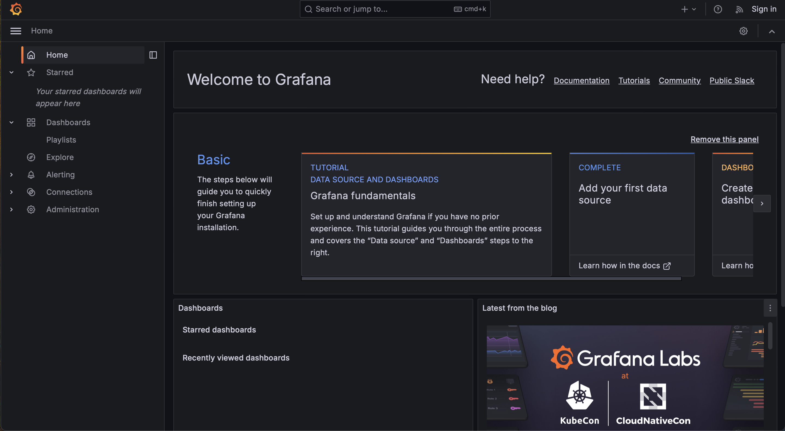
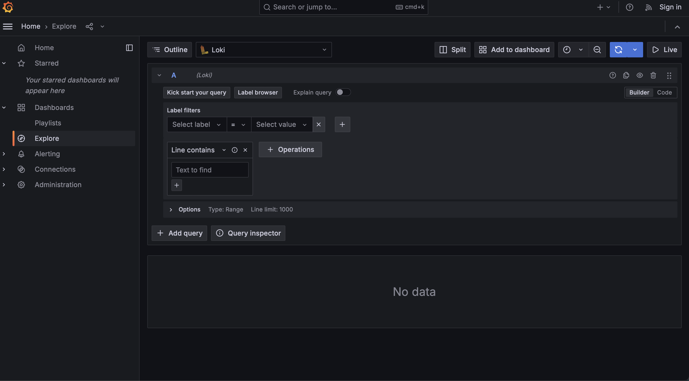
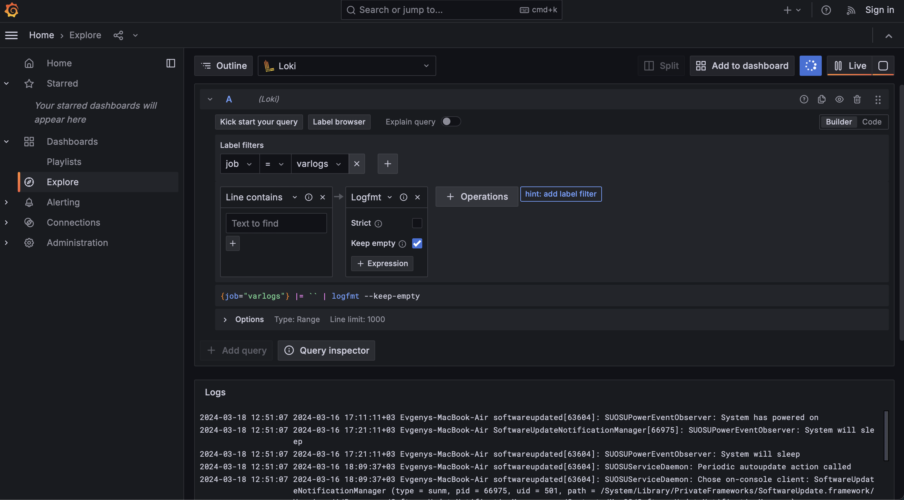
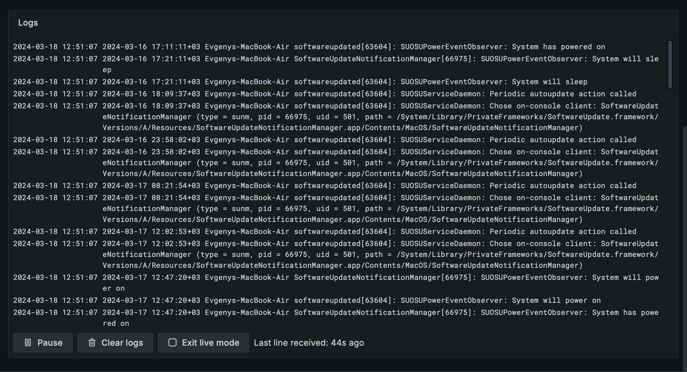

# Logging Configuration

## Overview

This logging configuration utilizes Grafana Loki, Grafana, and Promtail to collect, store, and visualize logs from Docker containers. Logs are collected from Docker containers by Promtail, stored in Loki, and visualized in Grafana.

## File Structure

- `docker-compose.yaml`: Docker Compose configuration file defining services for the Flask application, Grafana, Loki, and Promtail.
- `promtail.yaml`: Promtail configuration file defining log scraping targets and pipeline stages.

## Services

### Flask Application Service (`app-python`)

- **Image**: dzendos/app_python
- **Ports**: 5001:5000
- **Logging Configuration**: Utilizes JSON file logging driver with default settings.

### Loki Service (`loki`)

- **Image**: grafana/loki:2.9.2
- **Ports**: 3100:3100
- **Configuration**: Utilizes a local configuration file (`local-config.yaml`), mounted into the container.

### Promtail Service (`promtail`)

- **Image**: grafana/promtail:2.9.2
- **Volumes**: Mounts host `/var/log` directory into the container to collect logs.
- **Configuration**: Utilizes a local configuration file (`config.yml`), mounted into the container.

### Grafana Service (`grafana`)

- **Image**: grafana/grafana:latest
- **Ports**: 3000:3000
- **Environment Variables**: Configures Grafana with provisioning for datasources.
- **Configuration**: Automatically configures Loki datasource (`ds.yaml`) during startup.

## Logging Mechanism

- **Promtail**: Collects logs from Docker containers by scraping log files.
- **Loki**: Stores logs collected by Promtail and provides a query interface.
- **Grafana**: Visualizes logs stored in Loki using dashboards and panels.

## Accessing Logs

1. **Grafana**: Access Grafana at `http://localhost:3000` (or `http://127.0.0.1:3000`) to visualize logs.
2. **Explore Feature**: Use Grafana's Explore feature to query and explore logs stored in Loki.
3. **Dashboards**: Navigate to predefined dashboards in Grafana to view structured log data.

## Troubleshooting

- Check Docker Compose logs for individual services (`docker-compose logs <service_name>`) to troubleshoot startup issues.
- Ensure there are no port conflicts and that Docker networking is configured properly.
- Restart Docker and try accessing Grafana again if necessary.

