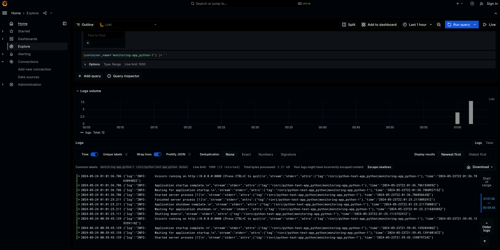

# Logging

## Promtail

Gathers logs and sends them to log aggregation systems.

## Loki

Log aggregation system. Takes the logs from promtail, stores them, and processes queries.

## Graphana

Is used to query loki through a convenient web interface with dashboards and many other features.

## Screenshots

