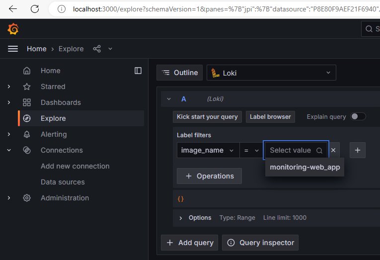
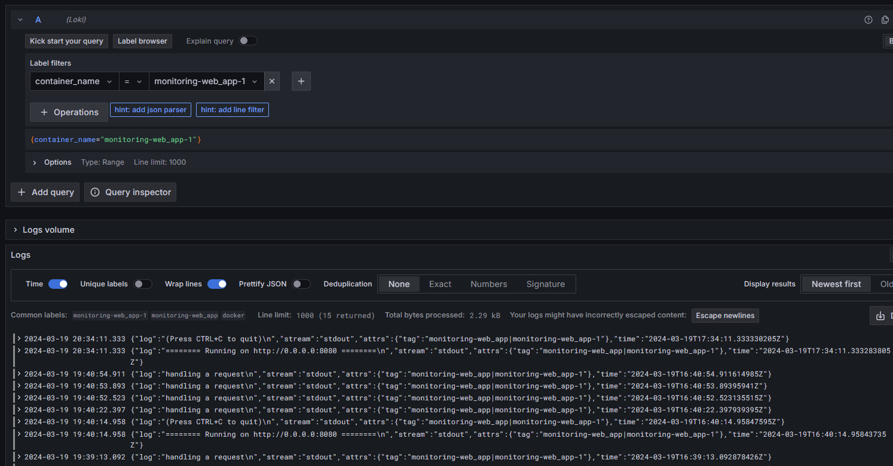

# Monitoring

The `docker-compose.yml` contains the Python application as well as the logging
stack.

The `web_app` service is the Python application. We add logging configuration so
that the logs are in the format expected by Promtail. Docker stores these logs
under `/var/lob/docker/containers`, where they will be picked up later.

The `promtail` service collects logs. It is configured appropriately to collect
logs from the Python application and label them by image and container names.
Then, Promtail sends them to Loki, which stores the logs.

The `grafana` service provides a way to view, search and analyze the logs. It is
yet another web app which is available on port 3000.

Here are a few screenshots of Grafana in action.

