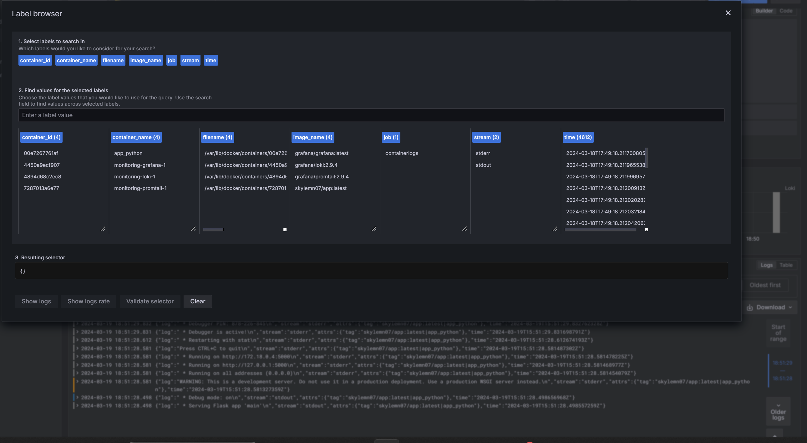
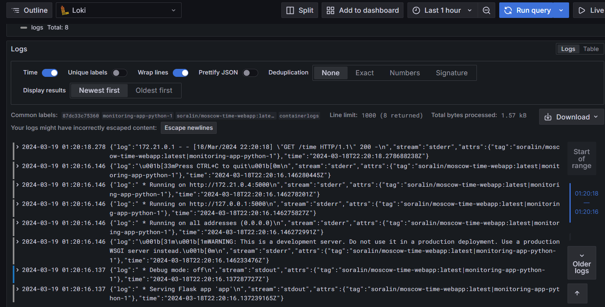

# Logging Stack

## Promtail
- Discovers docker container log files, attaches labels to log streams, and then pushes those logs to Loki

## Loki
- Acts like a log aggregation system that stores logs and processes log queries from the infrastructure

## Grafana
- Visualises collected logs, cooperates with Loki

# Screenshots
Available label filters that are used for log queries

Some logs for the query above
