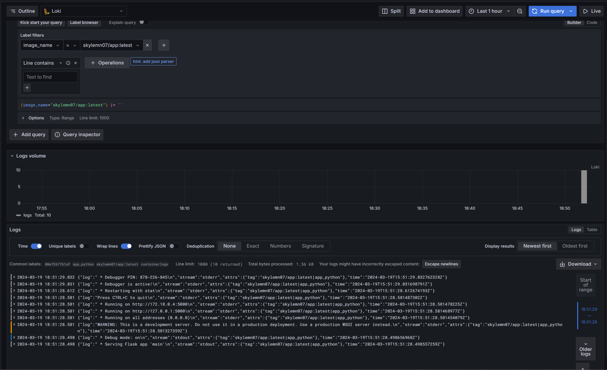

# Logging

## loki

Loki is a horizontally-scalable, multi-tenant log aggregation system inspired by Prometheus.

## promtail

Promtail is a logging agent used to collect log data from various sources and forward it to Loki for storage and analysis.

## grafana

Grafana is an open-source platform for data visualization, monitoring, and analytics.
