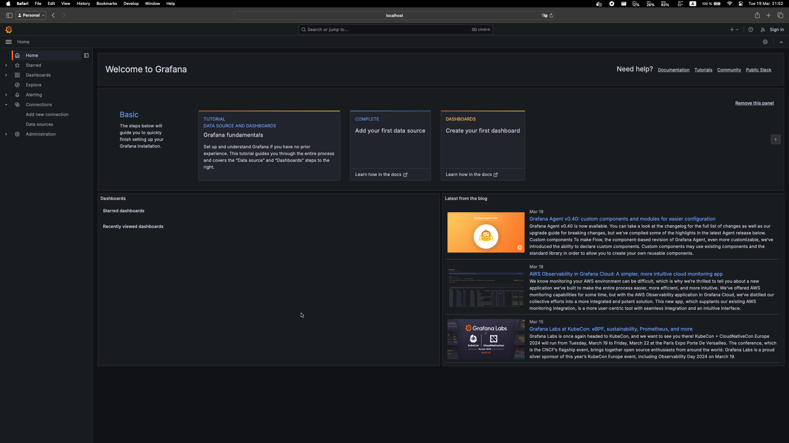
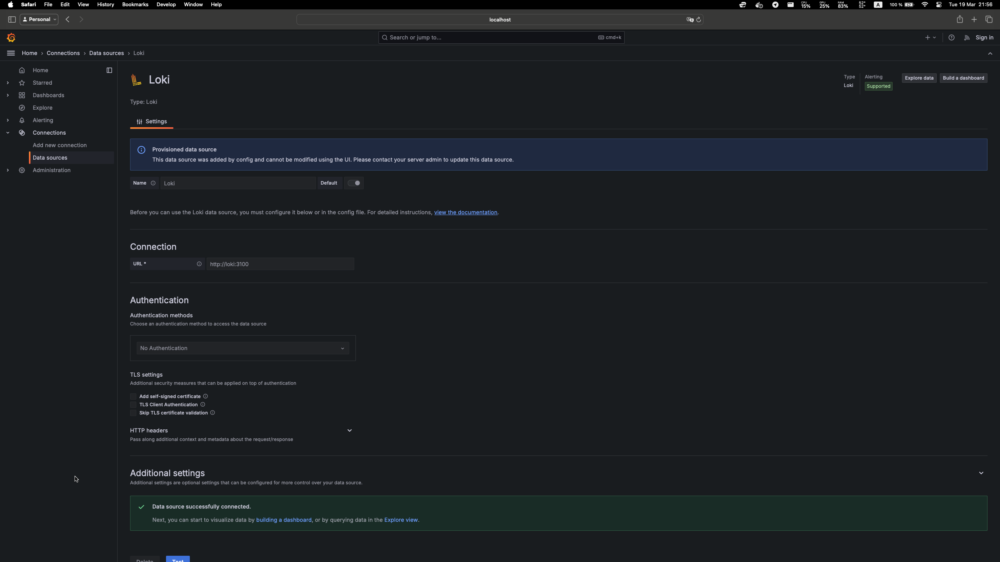
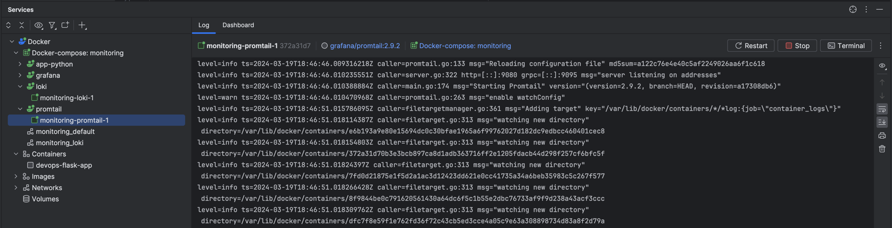
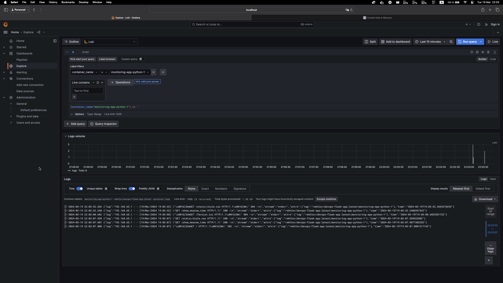

# Answers to Lab 7

## Components and their roles

### 1. Grafana

Within the stack, Grafana is a component used for log data querying and visualization. 
It offers a graphical user interface for log analysis and visualization. You may make dashboards 
and panels using Grafana to see log data displayed in a variety of ways, including tables, graphs, 
and heatmaps. Moreover, it provides sophisticated functions like alerting, which permits
you to configure alerts according to log information.

### 2. Loki

Logs are ingested, stored, and processed by Loki, the primary server component in the stack. 
It's a log aggregation system with a very economical and scalable design. Loki compresses and 
saves log data in chunks in object stores and indexes log metadata, including labels.

### 3. Promtail

Promtail is an agent or client that is used to push log streams to Loki over an HTTP API, 
add labels to log streams, and scrape logs. It is in charge of locating log files and programs 
that release log lines that must be observed. Promtail has the ability to tail logs from 
systemd journal and local log files.

## Test queries to the app-python:

