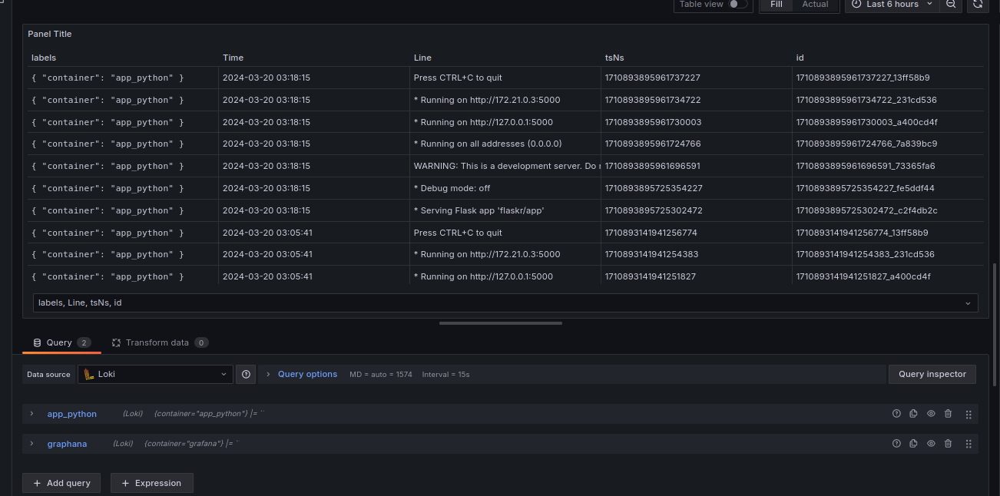
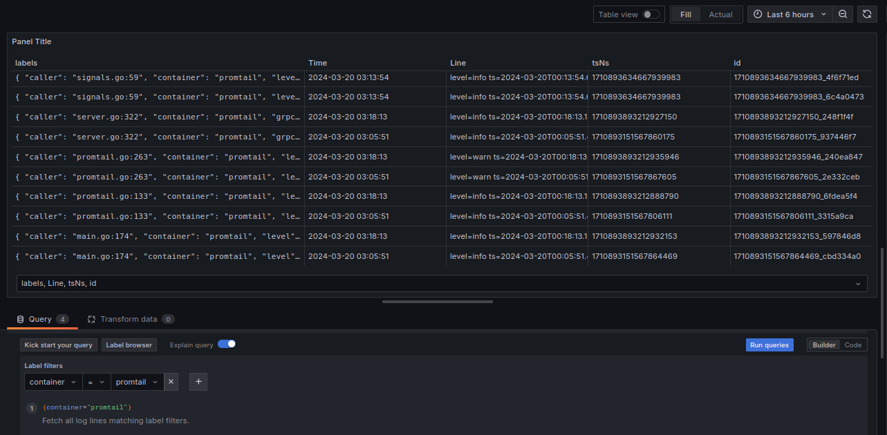

# Logging Stack Report

## Components

1. **Promtail** :

    * **Purpose** : Promtail is a log shipper used to tail log files and send them to Loki for storage and analysis.
    * **Functionality** : It collects logs from various sources, such as log files or Docker container output, and labels them with metadata before forwarding them to Loki.
    * **Interaction** : Promtail interacts with Loki by sending log entries over HTTP using the Loki Push API.

2. **Loki** :

    * **Purpose** : Loki is a horizontally scalable, highly available log aggregation system designed for cloud-native environments.
    * **Functionality** : It stores logs in a manner optimized for efficient querying and retrieval, using labels for indexing and compression for storage.
    * **Interaction** : Loki accepts log entries from Promtail and other clients via HTTP requests, indexes them based on labels, and stores them in object storage or a similar backend.

3. **Grafana** :

    * **Purpose** : Grafana is a visualization and analytics platform used to visualize logs stored in Loki and create dashboards for log exploration.
    * **Functionality** : It provides a user-friendly interface for querying and visualizing log data, enabling users to create custom dashboards and alerts.
    * **Interaction** : Grafana connects to Loki as a data source, allowing users to query log data and display it in various formats, such as tables, graphs, and histograms.

## results

### web_app

### grafana

### loki

### promtail

