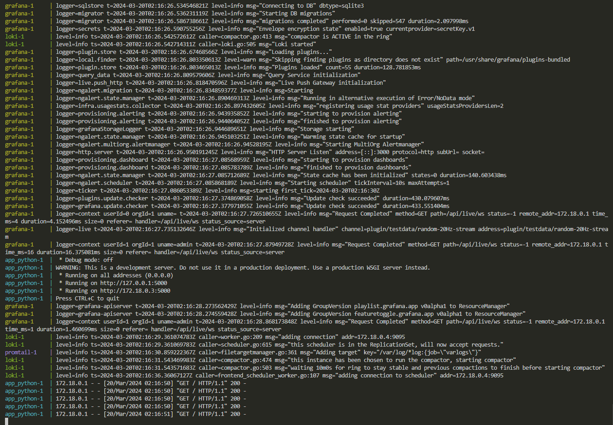
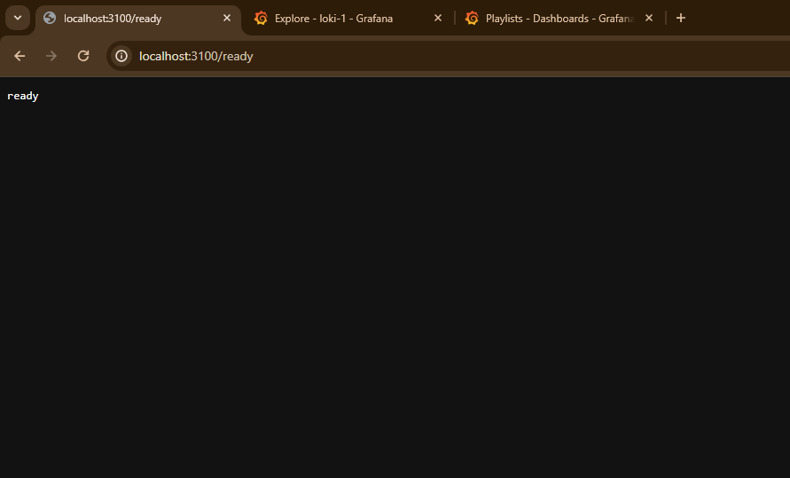
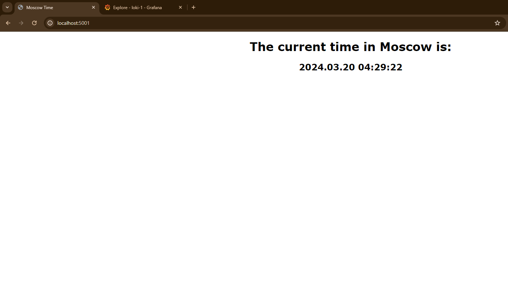
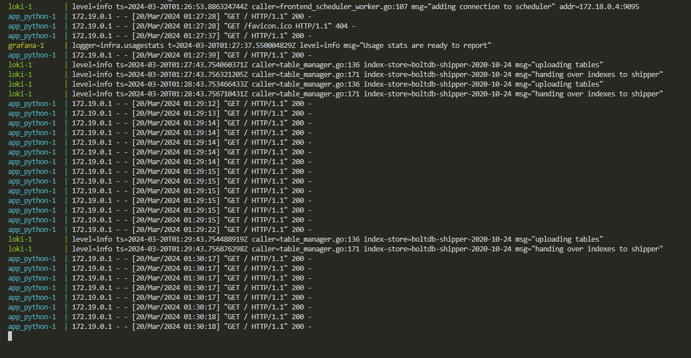

# Logging

## Mechanism

### Grafana

Using Grafana, we can monitor the logs of the application. It's role is to visualize the logs in a more readable format. Loki is included by default. 

### Loki

Using Loki, we store the logs of the application, it's efficient and optimized for logs. Uses Promtail to collect logs and store them in Loki.

### Promtail

Promtail ships the log content to our Loki instance. 

### Services included

1. app_python: Python basic web application that shows the current time in Moscow. It can be viewed at http://localhost:5000.

Screenshots: 

- Logging stack: 

- Loki ready: 

- app_python view: 

- app_python logs:

