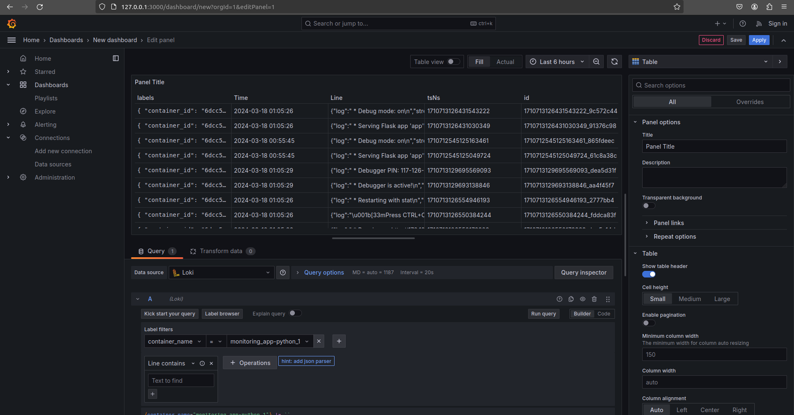
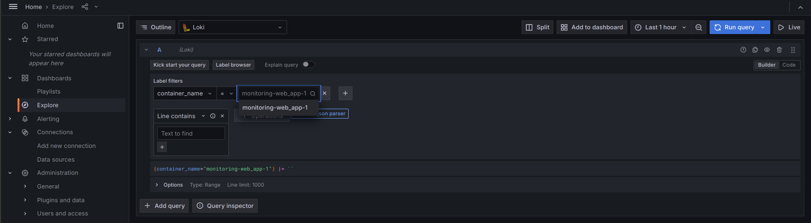
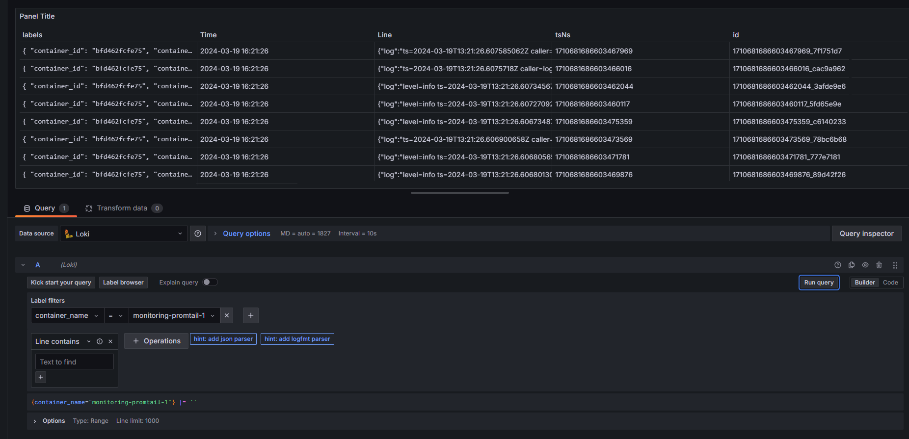

## Logging

The logging stack consists of Loki for log aggregation, Promtail for log collection, and Grafana for log
visualization.  
Promtail gathers and processes logs from Docker containers and sends them to Loki for analysis and storage using the
promtail.yml file.

## Components

### Loki

Loki is deployed using a Docker container and is responsible for storing and indexing logs collected by Promtail.

### Promtail

Promtail is configured in promtail.yml file. Promtail is responsible for collecting logs and sending them to Loki for
storage and processing.

### Grafana

Grafana is used for monitoring and observability, including log aggregation and visualization. Grafana is configured to
use Loki as a data source, enabling it to query logs stored in Loki for visualization.

### Screenshots

### App python

### Grafana

### Loki

### Promtail

