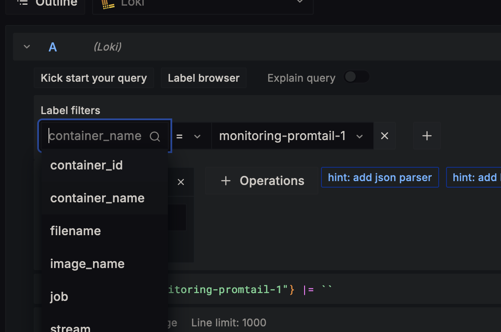
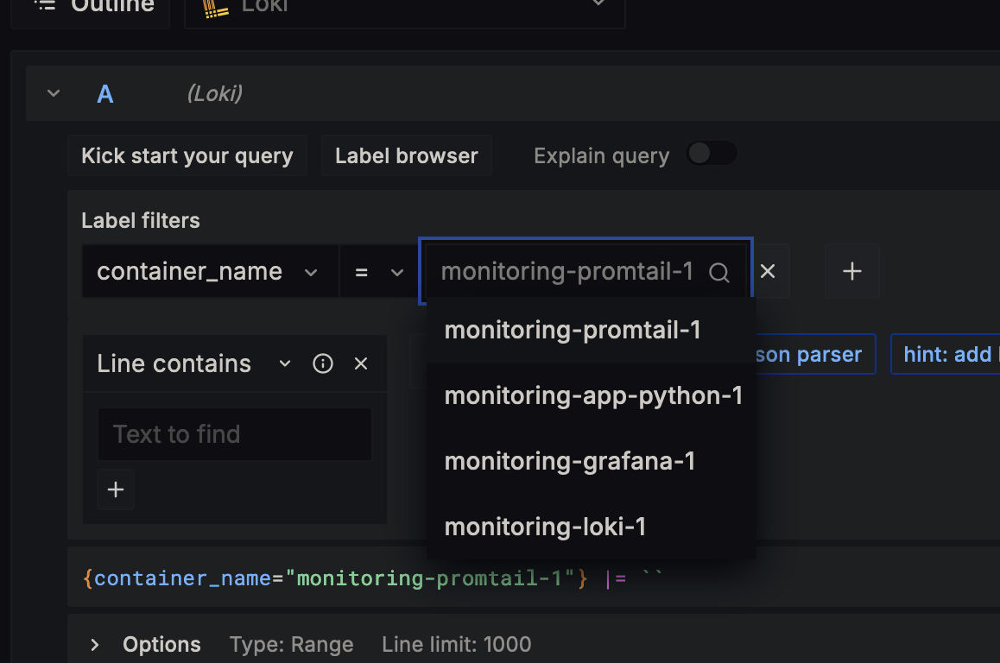
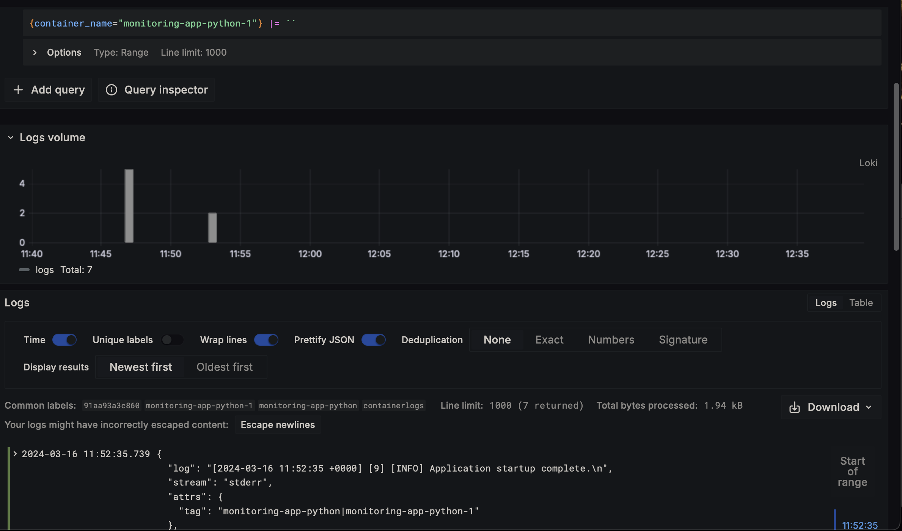
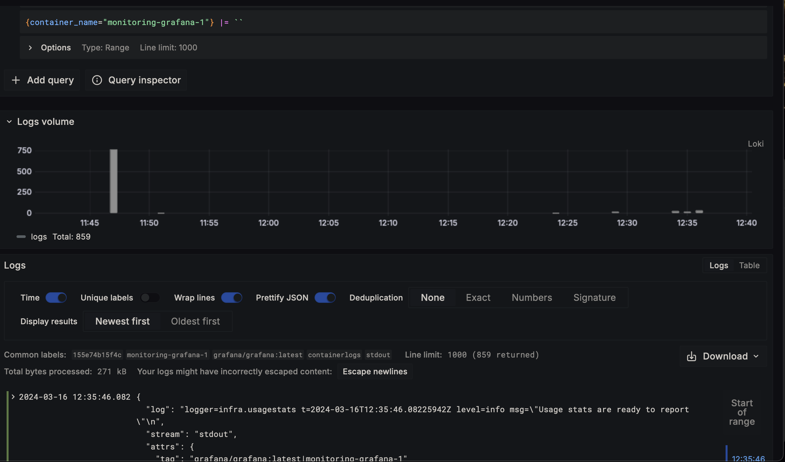
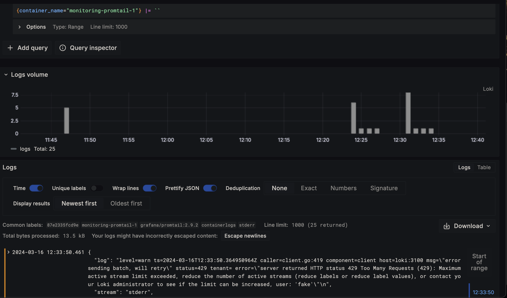
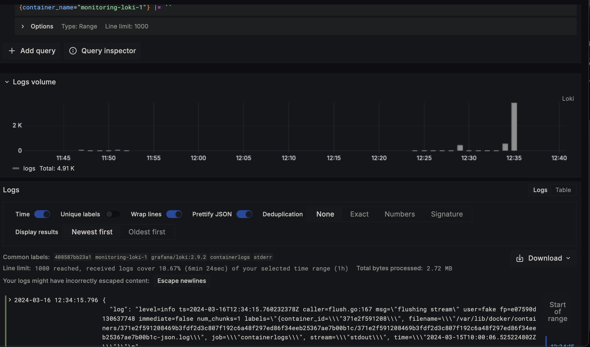

# Loggging

## How does it work

Grafana is a tool that enables graphical user interface for log/metric visualization. It offers a vast array of configurations for data aggregation and visualization techniques. Loki is a system designed for
efficient log aggregation, while Promtail acts as an agent to transfer local log content to Loki.

So, overall container produce log, docker redirect it to promptail, it transfer log to loki.  Loki aggreate data. Graphana provide user interface

## Collecting logs

Logs generated by active Docker containers are collected using Promtail. Containers are configured to use the same logging configuration, which results in logs being output in a standardized JSON format.

## Processing logs

The most crucial part of the promtail.yml configuration file is the scrape_configs section. This part outlines how Promtail locates and handles log files. In the provided setup, Promtail is configured to process Docker logs. It categorizes them based on various attributes such as stream, time, image name, container name, and container ID.

## Gallery

