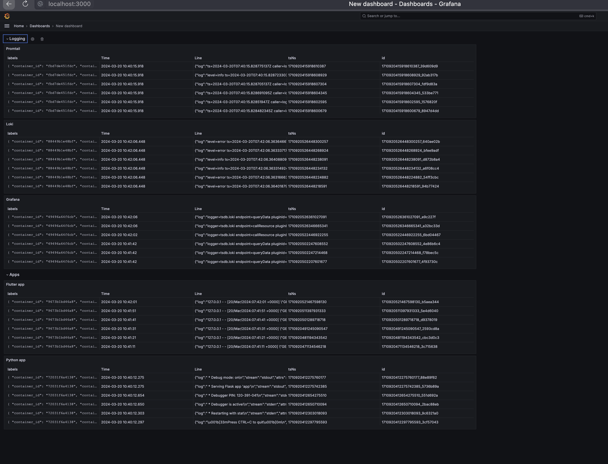
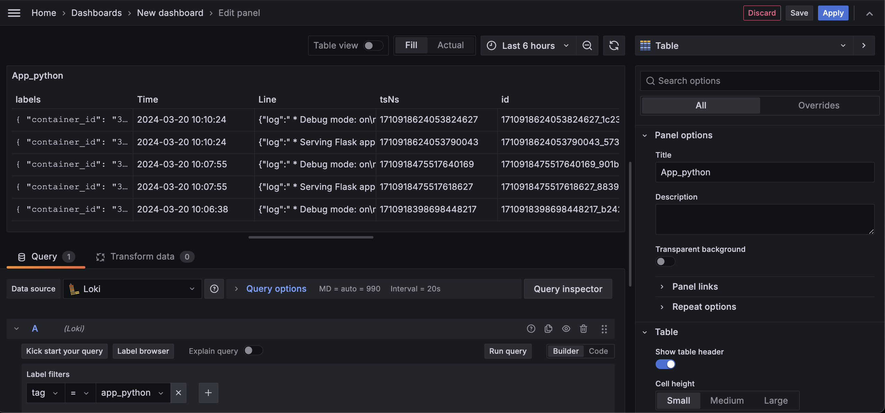
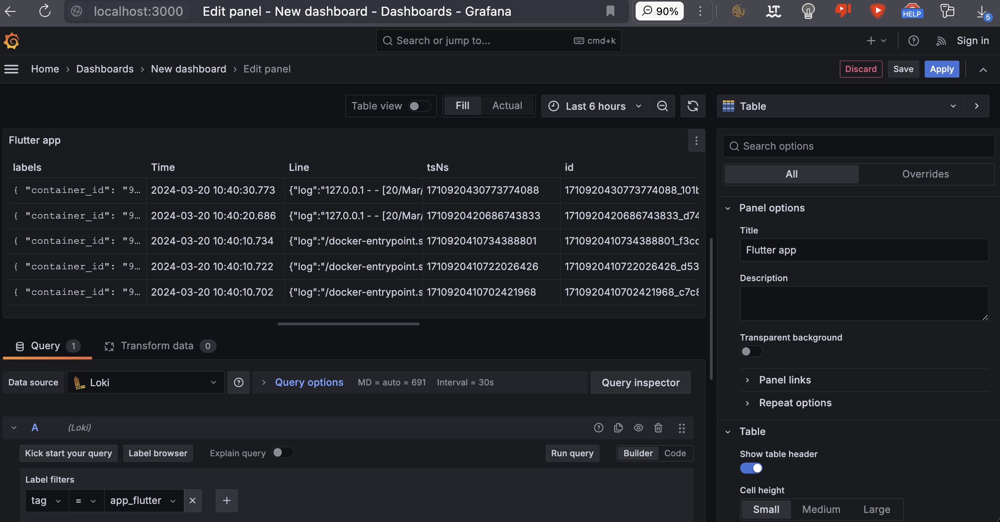

# Logging Stack Documentation

The logging stack set up using Docker Compose consists of four main components: `app_python`, `Loki`, `Promtail`, and `Grafana`. Below is a detailed explanation of each component and its role within the stack

## Components

### app_python

`app_python` is the application container running the actual service. It is built from a custom image and exposes port 8080 to the host system. It includes a health check that uses `curl` to ensure the application is running correctly


```yaml
app_python:
  image: timurharin/devops:latest
  ports:
    - "8080:5000"
  healthcheck:
    test: ["CMD", "curl", "-f", "http://localhost:8080"]
    interval: 10s
    timeout: 5s
    retries: 3
  logging:
    driver: json-file
    options:
      tag: app_python
      max-size: "10m"
      max-file: "10"
```

<br> </br>

### flutter app

`flutter app` is the application container running the actual flutter service. It is built from a custom image and exposes port 80 to the host system. It includes a health check that uses `curl` to ensure the application is running correctly


```yaml
app_flutter:
    image: timurharin/flutter_web:latest
    ports:
      - "80:80"
    healthcheck:
      test: ["CMD", "curl", "-f", "http://localhost"]
      interval: 10s
      timeout: 5s
      retries: 3
    logging:
      driver: json-file
      options:
        tag: app_flutter
        max-size: "10m"
        max-file: "10"
```

<br> </br>

### Loki

`Loki` is the centralized logging system that aggregates logs from various sources. It is designed for efficiency and ease of use with a low operational cost

```yaml
loki:
  image: grafana/loki:2.9.2
  ports:
    - "3100:3100"
  command: -config.file=/etc/loki/local-config.yaml
  logging:
    driver: json-file
    options:
      tag: loki
      max-size: "10m"
      max-file: "10"
```

<br> </br>

### Promtail

`Promtail` is the agent responsible for gathering logs and sending them to Loki. It discovers targets, attaches labels to log streams, and ships the logs to Loki

```yaml
promtail:
  image: grafana/promtail:2.9.2
  volumes:
    - ./promtail.yml:/etc/promtail/config.yml
    - /var/lib/docker/containers:/var/lib/docker/containers
  command: -config.file=/etc/promtail/config.yml
  logging:
    driver: json-file
    options:
      tag: promtail
      max-size: "10m"
      max-file: "10"
```

The `promtail.yml` file contains configurations for log scraping and processing:

- `server`: Configures the Promtail server
  - `http_listen_port`: The port on which Promtail's HTTP server listens (9080 in this case)
  - `grpc_listen_port`: The port for gRPC server to listen on. Set to 0 to disable

- `positions`: Keeps track of the last read position in each log file
  - `filename`: The path to the file where Promtail stores its positions (`/tmp/positions.yaml`)

- `clients`: Configures the Loki instances where Promtail sends logs
  - `url`: The endpoint for pushing logs to Loki (`http://loki:3100/loki/api/v1/push`)

- `scrape_configs`: Defines the set of targets and configurations for scraping logs from sources
  - `job_name`: A name for this scrape job (`containers`)
  - `static_configs`: Static targets and labels for the job
    - `targets`: List of targets to scrape, with `localhost` indicating where docker containers are running
    - `labels`: Labels to assign to the scraped logs, such as `job: docker`
    - `__path__`: Path to the log files to scrape (`/var/lib/docker/containers/*/*log`)

- `pipeline_stages`: Defines the processing stages for each log entry
  - `json`: Parses json logs and extracts fields
  - `timestamp`: Extracts and formats timestamp from the logs
  - `regex`: Uses regular expressions to extract labels from file paths or tags
  - `labels`: Maps extracted values to log labels
  - `output`: Defines the log entry source to be sent to Loki

<br> </br>


### Grafana

Grafana is an open-source platform for monitoring and observability. It allows you to query, visualize, alert on, and understand your metrics no matter where they are stored

```yaml
grafana:
  ...
  image: grafana/grafana:latest
  ports:
    - "3000:3000"
  logging:
    driver: json-file
    options:
      tag: grafana
      max-size: "10m"
      max-file: "10"
```

The grafana service is configured to provision a data source that points to Loki, allowing logs to be visualized within Grafana

The stack components are interconnected, with Promtail collecting logs and forwarding them to Loki, which is then queried by Grafana for visualization and analysis

<br> </br>

## Logging mechanism

The logging mechanism for each container in the `docker-compose.yml` file is as follows:

1. **app_python** container:
   - Logging Driver: `json-file`
   - Logging Options:
     - Tag: `app_python`
     - Max Size: `10m`
     - Max File: `10`

2. **app_flutter** container:
   - Logging Driver: `json-file`
   - Logging Options:
     - Tag: `app_flutter`
     - Max Size: `10m`
     - Max File: `10`

3. **loki** container:
   - Logging Driver: `json-file`
   - Logging Options:
     - Tag: `loki`
     - Max Size: `10m`
     - Max File: `10`

4. **promtail** container:
   - Logging Driver: `json-file`
   - Logging Options:
     - Tag: `promtail`
     - Max Size: `10m`
     - Max File: `10`

5. **grafana** container:
   - Logging Driver: `json-file`
   - Logging Options:
     - Tag: `grafana`
     - Max Size: `10m`
     - Max File: `10`

Each container uses the `json-file` logging driver with specific options for tagging, maximum size, and maximum number of log files

<br> </br>


## Screenshots

### full


### app_python


### app_flutter


### grafana


### loki


### promtail


