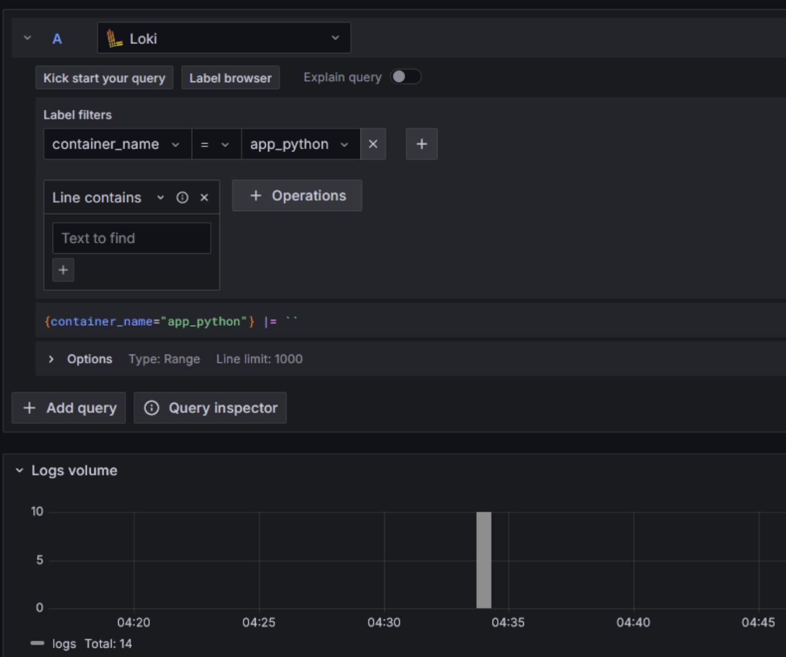

# Logging Solution Overview

## Grafana Integration
- Utilize a user-friendly web interface to access log data and integrate seamlessly with Loki.
- Allows connection to diverse sources, facilitates data connection via multithreading, and offers sophisticated visualization through the creation of intricate monitoring panels.
- Access via `http://localhost:3000`.

## Loki Insight
- Loki serves as a log aggregation system, adept at storing and querying logs from all applications and infrastructure components. Drawing inspiration from Prometheus.
- Accessible to Grafana within Docker at `http://loki:3100`.

## Promtail Deployment
- Promtail operates as an agent responsible for transmitting local log contents to a private Grafana Loki instance or Grafana Cloud.
- Typically deployed on each machine running applications slated for monitoring.
- Its core functionalities include target discovery, labeling of log streams, and pushing them to the Loki instance.

This logging solution comprises several interconnected components collaborating to gather, store, and visualize logs emanating from a variety of services within a Dockerized environment. Central to this stack is `Grafana Loki`, functioning as the centralized log aggregation system, with `Promtail` serving as the agent for log shipment to `Loki`, while `Grafana` facilitates log visualization.

The configuration for deploying these components with a web service is defined in the `docker-compose.yml` file.

## Configuration

To establish the logging solution, execute `docker compose up`.

## Screenshots with containers

