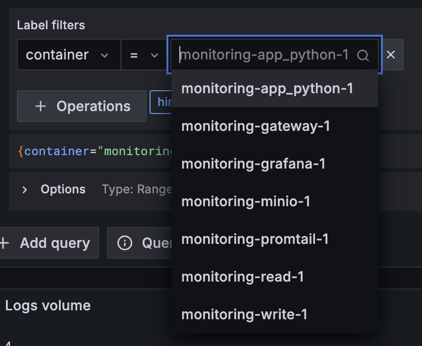

# Logging

## Scheme

- app_python - my app
- promtail - gathering logs from containers (from docker socket)
- gateway - nginx server for managing services communication
- read / write - loki aggragate db system instances
- grafana - data visualization

## Result

