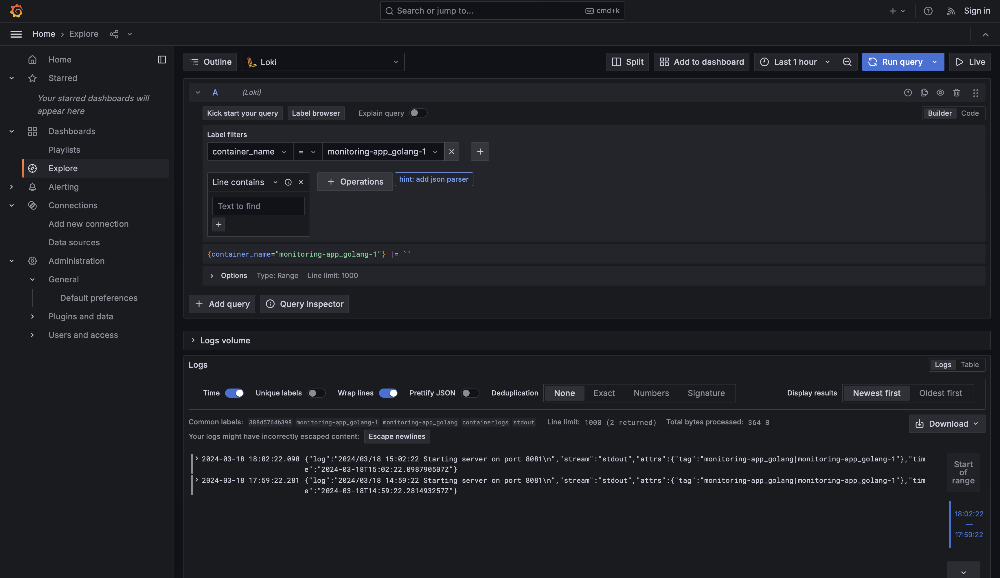
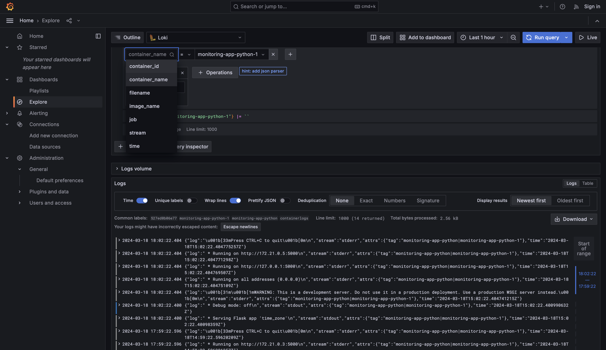
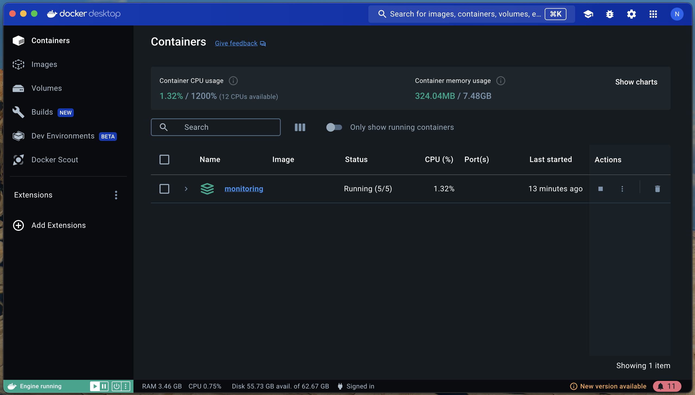
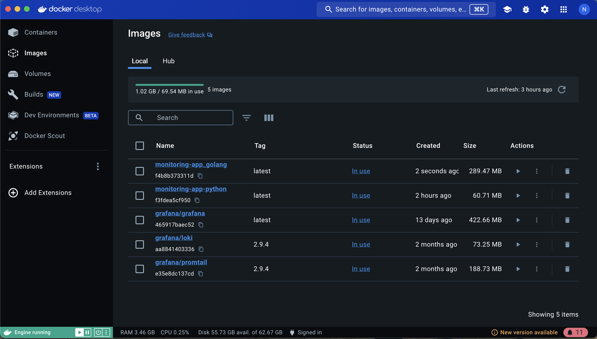

# Logging Configuration

## Overview

This logging configuration gathers, stores, and displays logs from Docker containers using Grafana Loki, Grafana, and Promtail. Promtail gathers logs from Docker containers, stores them in Loki, and displays them in Grafana.

## File Structure

- `docker-compose.yaml`: configuration file which defines services for the Flask application, Go application, Grafana, Loki, and Promtail.
- `promtail.yaml`: configuration file which defines log scraping targets and pipeline stages.

## Services

### Flask Application Service (`app_python`)

- **Build**: ../app_python
- **Ports**: 5001:5001
- **Logging Configuration**: uses the JSON file logging driver in its default configuration.

### Go Application Service (`app_golang`)

- **Build**: ../app_golang
- **Ports**: 8081:8081
- **Logging Configuration**: Utilizes /app/logs files created by go application logging driver with default settings.

### Loki Service (`loki`)

- **Image**: grafana/loki:2.9.4
- **Ports**: 3100:3100
- **Configuration**: makes use of a local configuration file that is mounted within the container `local-config.yaml`.

### Promtail Service (`promtail`)

- **Image**: grafana/promtail:2.9.4
- **Volumes**: logs are collected by mounting the host's {/var/log} directory inside the container.
- **Configuration**: makes use of a local configuration file that is mounted inside the container `config.yml`.

### Grafana Service (`grafana`)

- **Image**: grafana/grafana:latest
- **Ports**: 3000:3000
- **Environment Variables**: Sets up Grafana with datasource provisioning configured.
- **Configuration**: Upon starting, the Loki datasource `ds.yaml` is automatically configured.

## Logging Mechanism

- **Promtail**: uses log file scraping to gather logs from Docker containers.
- **Loki**: stores the logs that Promtail has gathered and offers a query interface.
- **Grafana**: uses dashboards and panels to visualise logs that are stored in Loki.

## Accessing Logs

1. **Grafana**: Access Grafana at `http://localhost:3000` (or `http://127.0.0.1:3000`) to visualize logs.
2. **Explore Feature**: Use Grafana's Explore feature to query and explore logs stored in Loki.

## The full view of labels to be shown

## The state of the docker containers 

