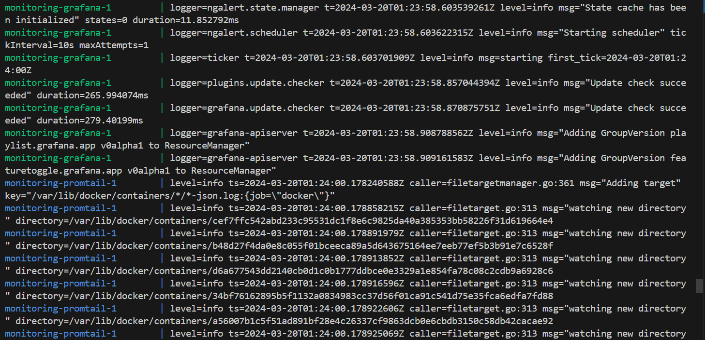
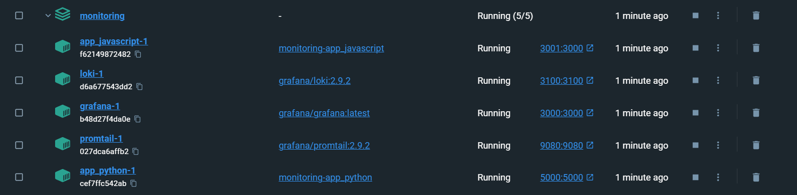
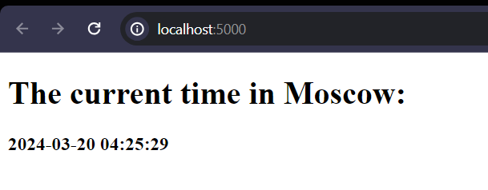
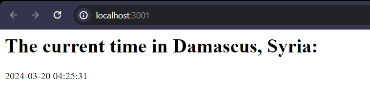
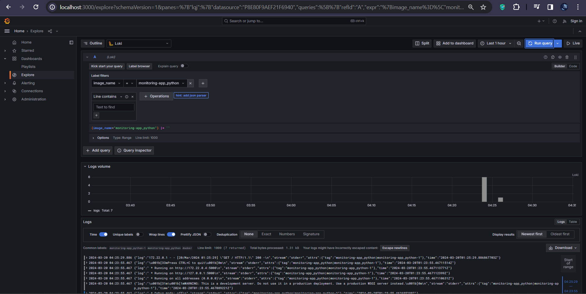
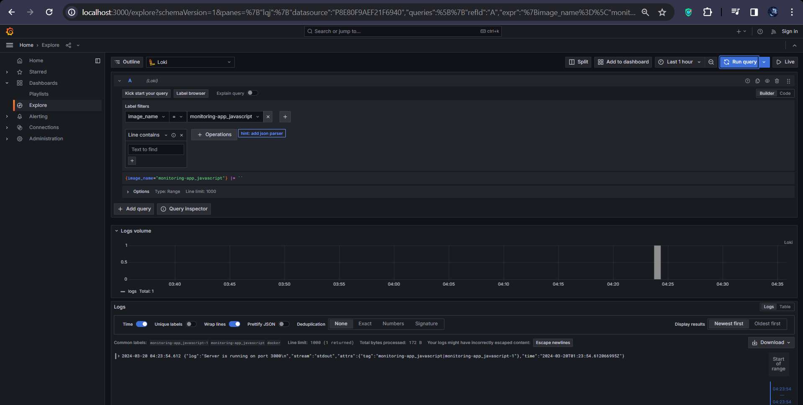
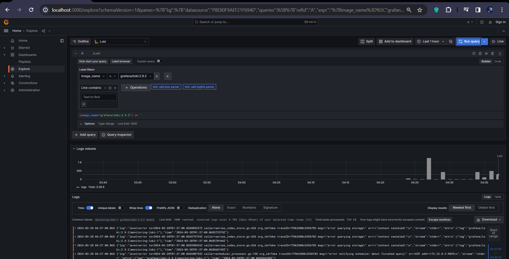
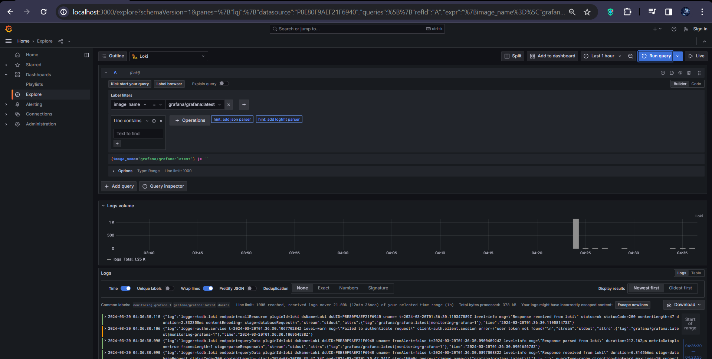
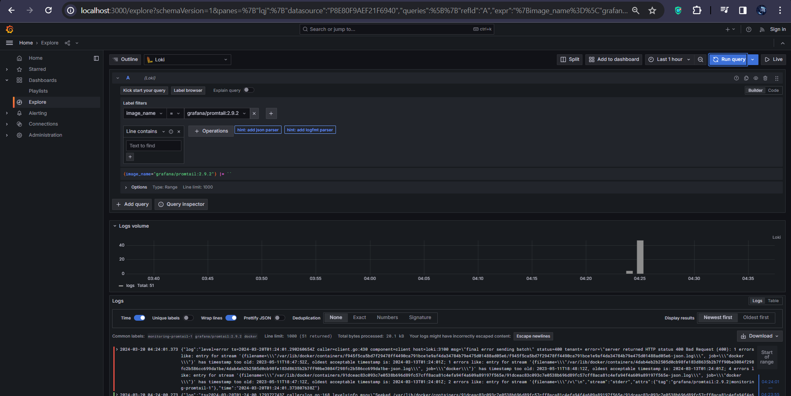

# Logging Stack Report

## Overview

The logging stack consists of Loki, Promtail, and Grafana, enabling efficient log collection, storage, and visualization.

## Components

- **Loki**: Scalable log aggregation system for efficient storage and indexing.
- **Promtail**: Agent for streaming logs to Loki from various sources.
- **Grafana**: Analytics and visualization platform for querying and visualizing logs.

## Functionality

- **Loki**: Receives and indexes log streams from Promtail agents.
- **Promtail**: Tails log files, parses log lines, and forwards them to Loki.
- **Grafana**: Provides user-friendly interface for exploring and visualizing logs.

## Usage

To use the logging stack:
1. Ensure Docker is installed on the host machine.
2. Deploy the logging stack using the provided `docker-compose.yml` file.
3. Access Grafana at `http://localhost:3000` to visualize logs and create dashboards.

## Screenshots

### Terminal Logs

### Docker desktop

### Python app page

### Javascript app page

### Monitor python 

### Monitor js 

### Monitor loki 

### Monitor grafana 

### Monitor promtail 

