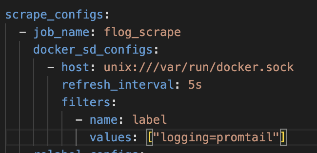
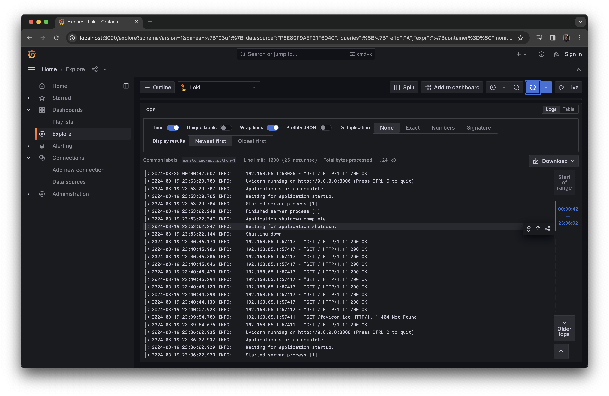
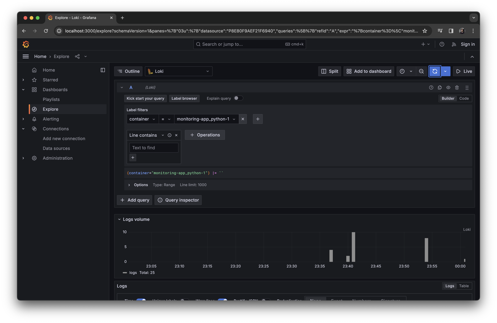

# How it works

We use

1. **Grafana** as a data sources aggregator that can make cool visualizations
2. **Loki** as a logs aggregator
3. **Promtail** as a logs collector

We have set up that Promtail should collect logs from the Docker containers that have the following label:
`logging: "promtail"`

Result:

