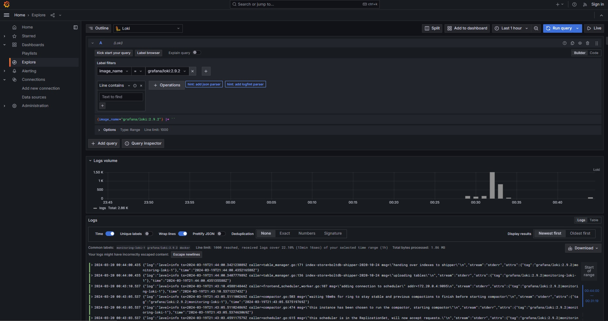
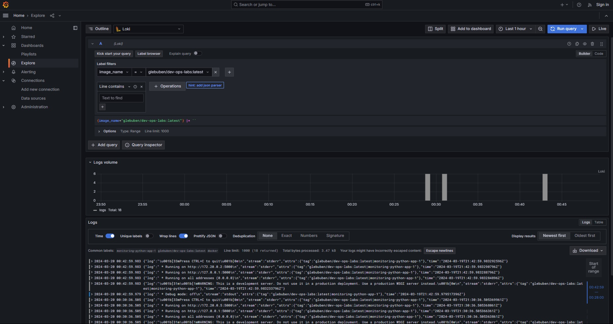
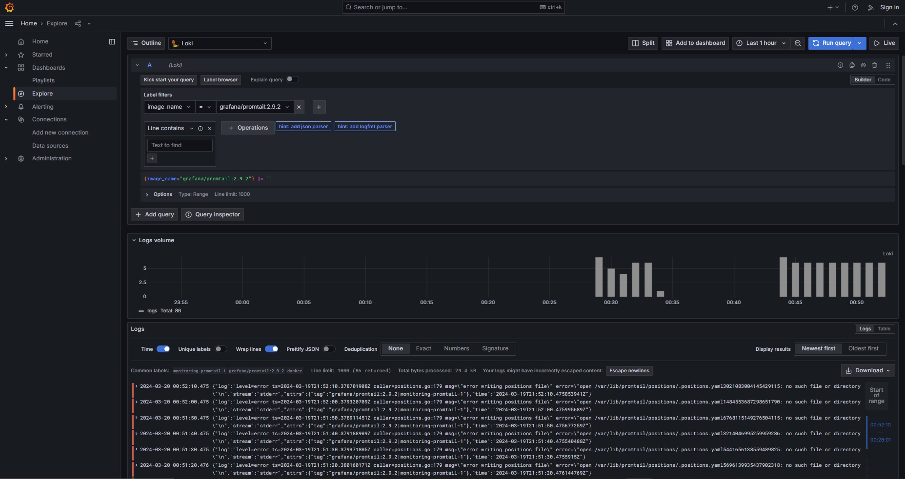
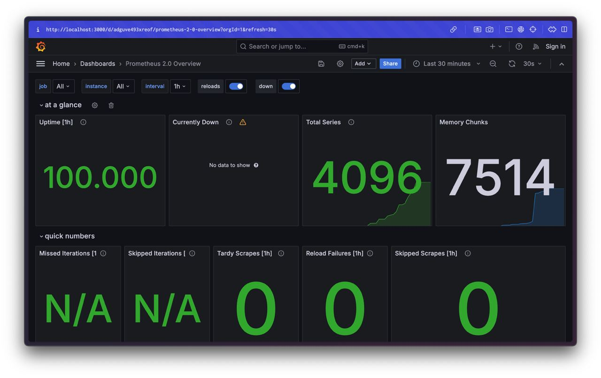

# Docker Compose Stack Overview

This document provides an overview of the Docker Compose stack including various components and their roles within the setup.

## How to Use the Logging System

1. **Setting Up Docker Compose Stack**: 
   - Ensure you have Docker and Docker Compose installed on your system.
   - Save the provided Docker Compose configuration as `docker-compose.yml` in your project directory.

2. **Configuring Promtail**:
   - Customize `promtail.yml` as needed for your log collection requirements. Ensure that the `__path__` specified under `scrape_configs` matches the location of your Docker container logs.
   - Modify the regex expressions and selectors in `promtail.yml` according to your log tagging and filtering needs.

3. **Starting the Stack**:
   - Navigate to your project directory containing the `docker-compose.yml` file.
   - Run `docker-compose up -d` to start the stack in detached mode.
   - This will pull the necessary Docker images, create containers, and start the services defined in the Docker Compose file.

4. **Accessing Grafana**:
   - Once the stack is up and running, access Grafana at `http://localhost:3000`.
   - Log in to Grafana (if necessary) using the default credentials or as configured in your environment.
   - Explore the dashboards and queries to visualize and analyze your log data stored in Loki.

## Overview of Files

### `docker-compose.yml`
- **Purpose**: Defines the Docker services, networks, and logging configuration for the stack.
- **Components**:
  - `services`: Defines individual services such as Loki, Python-app, Promtail, and Grafana, along with their configurations.
  - `networks`: Defines a custom network named `loki` for inter-service communication.
  - `x-logging`: Defines a default logging configuration reused across services.

### `promtail.yml`
- **Purpose**: Configures Promtail, the log shipping agent, for collecting and forwarding logs to Loki.
- **Components**:
  - `server`: Configures Promtail server settings.
  - `positions`: Specifies the file to store log positions to resume tailing.
  - `client`: Defines the destination URL where Promtail sends logs (Loki API).
  - `scrape_configs`: Configures log scraping targets, regex parsing, and filtering rules.
- **Customizing Labels**:
  - Modify the `labels` section under `scrape_configs` in `promtail.yml` to suit your log tagging requirements.
  - The provided configuration includes the following labels:
    - `job`: Specifies the job name for identifying the log source. In this case, it's set to `docker`.
    - `__path__`: Indicates the path pattern for log file discovery. It's set to `/var/lib/docker/containers/*/*log` to collect logs from Docker containers.
    - `image_name`: Extracts the name of the Docker image from the log tag using a regex pattern.
    - `container_name`: Extracts the name of the Docker container from the log tag using a regex pattern.
  - Adjust the regex expressions and label names as needed to match your log tagging conventions and requirements.

## Services description
### Loki
- **Image**: `grafana/loki:2.9.2`
- **Ports**: Exposes port `3100`.
- **Command**: `-config.file=/etc/loki/local-config.yaml`.
- **Logging**: Utilizes the default logging configuration specified in `x-logging`.
- **Networks**: Connected to the `loki` network.

**Role**: Loki is a horizontally-scalable, highly-available log aggregation system designed to handle large volumes of log data efficiently.

### Python-app
- **Image**: `glebuben/dev-ops-labs:latest`
- **Ports**: Maps port `8000` on the host to port `5000` in the container.
- **Logging**: Utilizes the default logging configuration specified in `x-logging`.
- **Networks**: Connected to the `loki` network.

**Role**: This service is a Python application running in a Docker container.

### Promtail
- **Image**: `grafana/promtail:2.9.2`
- **Volumes**: Mounts host directories for logs and configuration files.
- **Command**: `-config.file=/etc/promtail/config.yml`.
- **Logging**: Utilizes the default logging configuration specified in `x-logging`.
- **Networks**: Connected to the `loki` network.

**Role**: Promtail is a log shipping agent responsible for collecting logs from various sources and forwarding them to Loki for processing and storage.

### Grafana
- **Image**: `grafana/grafana:latest`
- **Environment Variables**: Configures Grafana with necessary settings.
- **Entrypoint Script**: Sets up a data source for Loki within Grafana's provisioning system.
- **Ports**: Maps port `3000` on the host to port `3000` in the container.
- **Logging**: Utilizes the default logging configuration specified in `x-logging`.
- **Networks**: Connected to the `loki` network.

**Role**: Grafana is a visualization and monitoring tool configured to use Loki as a data source, allowing users to query and visualize log data stored in Loki. It also allows anonymous access with administrative privileges.

