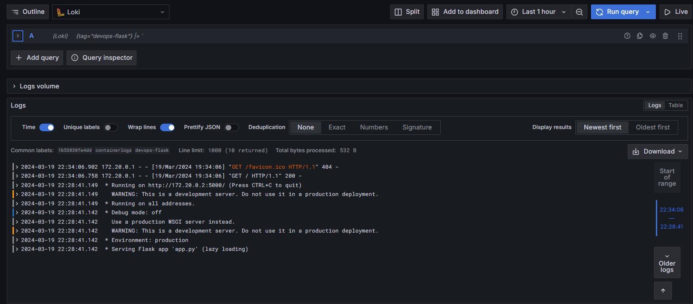

# Stack explanation

## Promtail
- Promtail is responsible for identifying and managing logs generated by containers.
- It organizes logs into categories and forwards them to Loki.

## Loki
- Loki serves as the storage solution for logs received from Promtail.
- It includes a search functionality for efficiently querying and retrieving logs.

## Grafana
- Grafana offers interface for interacting with Loki.
- It allows to send queries to Loki and visualize the results for monitoring and analysis purposes.

# Screenshots

## tag: devops_flask
