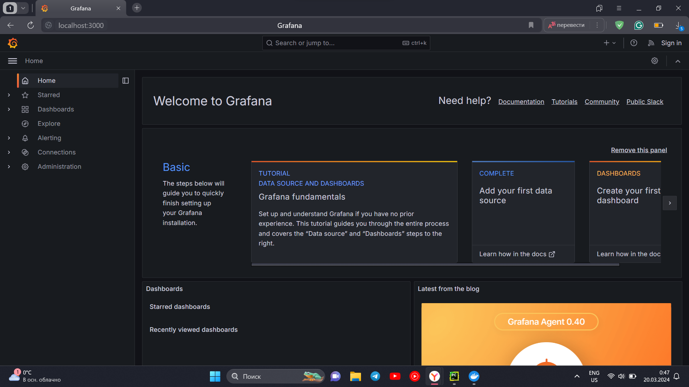
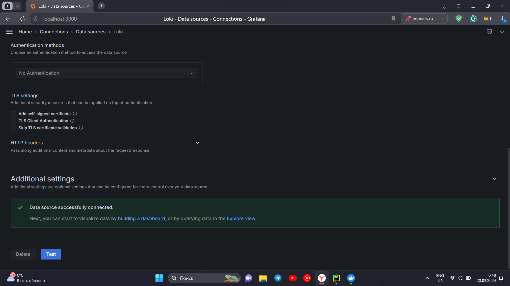
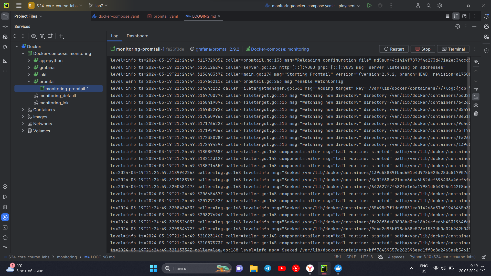
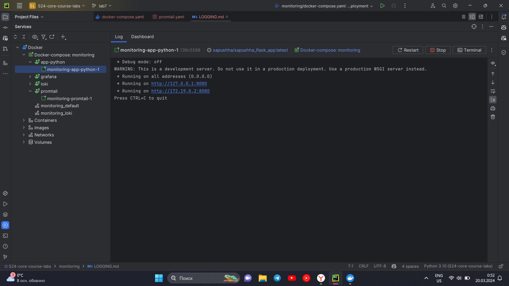
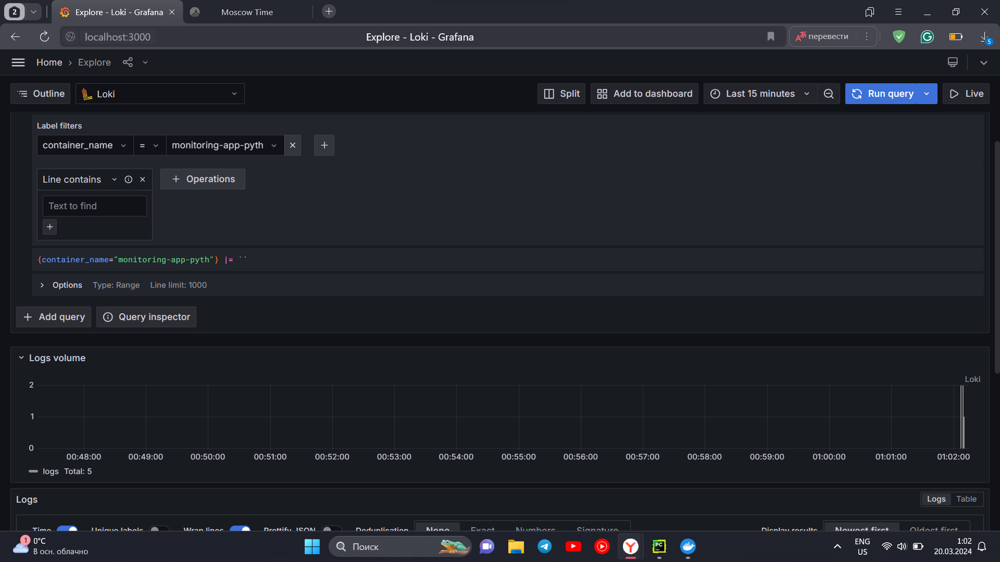

# Logging Stack

## Components

### Grafana

Grafana is a vital part of the logging stack, providing advanced
capabilities for visualizing and monitoring logs, metrics, and traces. It
seamlessly integrates with Loki, Mimir, and Tempo, enabling a comprehensive
observability stack and facilitating correlation between logs, metrics, and
traces. Grafana empowers users to create interactive dashboards and alerts
based on log data. It serves as a user-friendly interface for exploring and
visualizing logs, making it a popular choice for consolidating and analyzing
log data.

Grafana UI on my laptop:

### Loki

Loki is the central server component of the logging stack. Its
primary function is to ingest, store, and process logs. Loki can be deployed in
various configurations and is designed to efficiently index metadata about
logs, such as labels.

Successful connection to Loki:

### Promtail

Promtail serves as the agent or client component of the logging
stack. Its role is to collect logs from different sources and send them to Loki
for storage and processing. Promtail can tail logs from local log files and the
systemd journal. It discovers targets, attaches labels to log streams, and
pushes them to the Loki instance.

Logs of working Promtail:

### Python App

Logs of working Python app:

## Example of query

