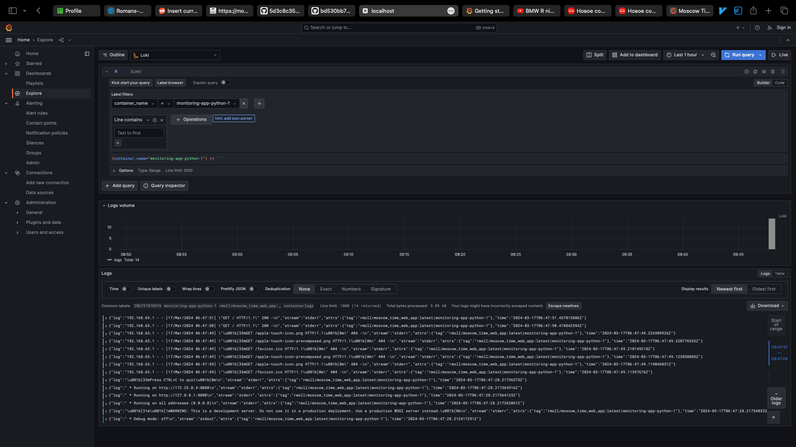
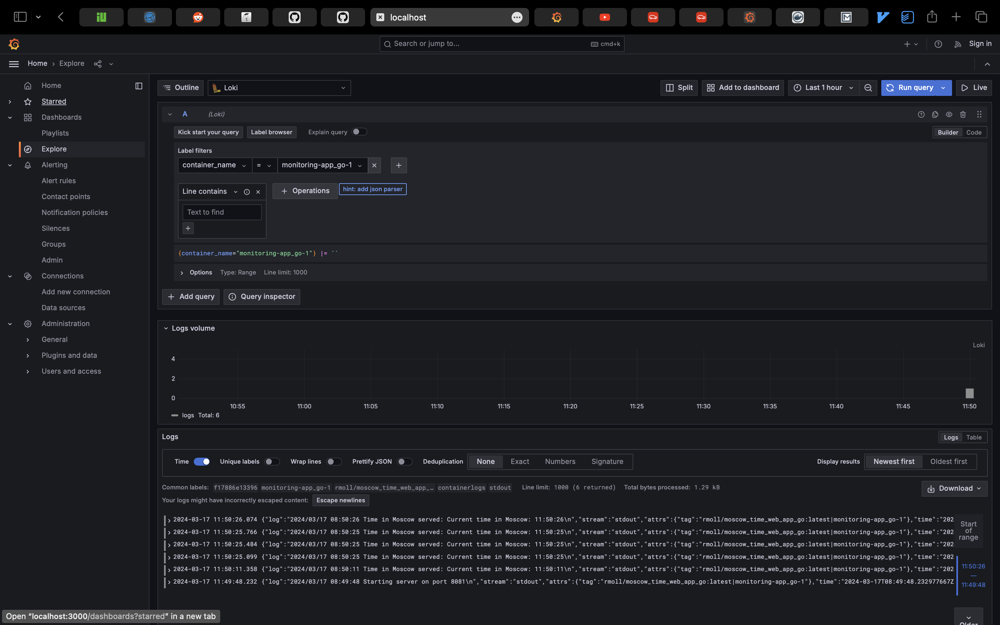
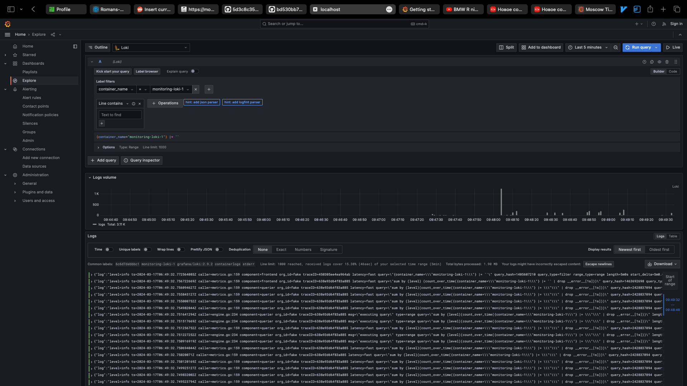
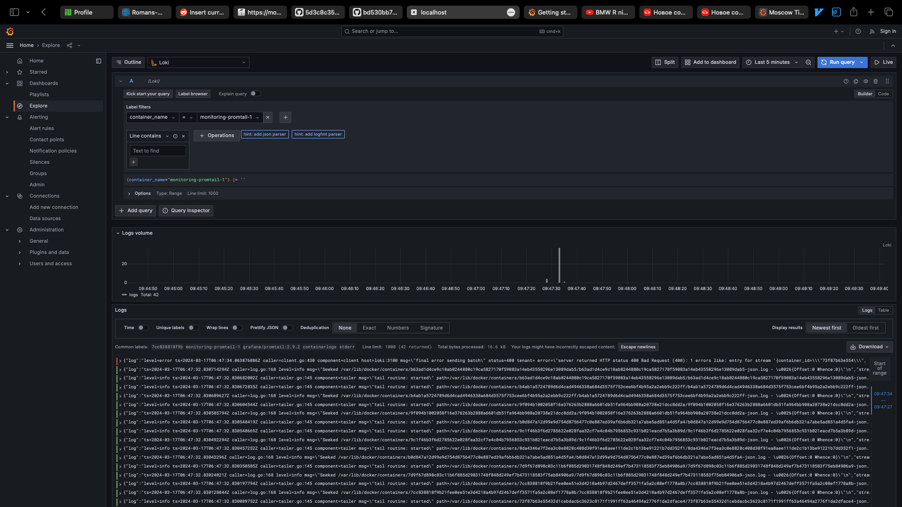
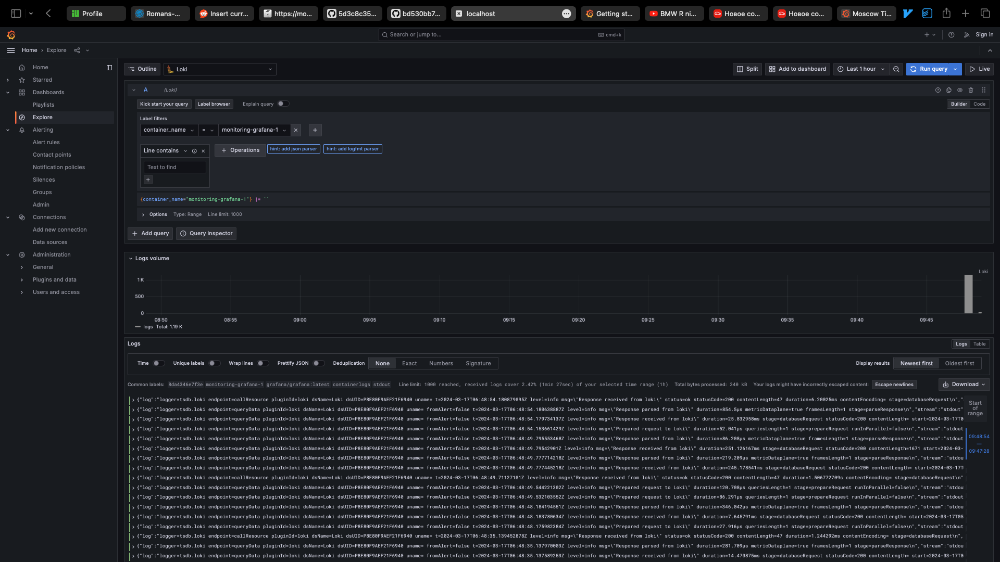
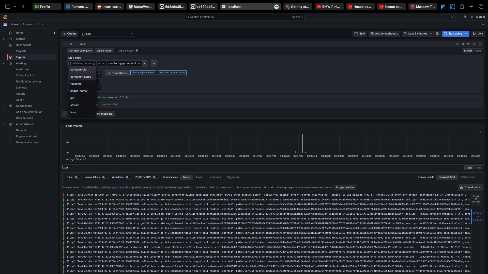
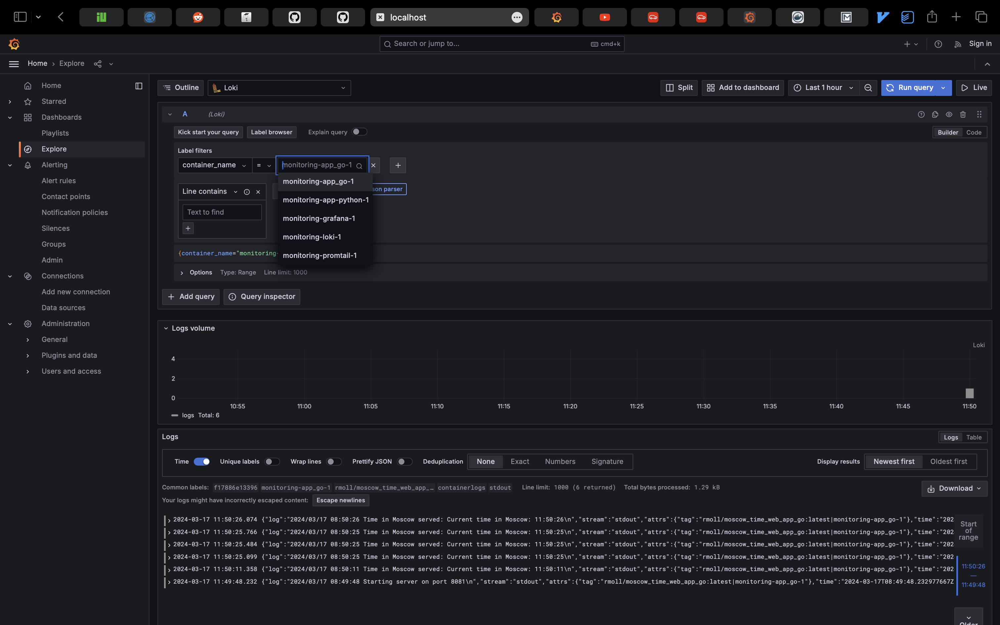

# Logging Stack Report

## Introduction
This logging stack is composed of multiple components that work together to collect, store, and visualize logs from various services running within a Docker environment. The stack uses Grafana Loki as a centralized log aggregation system, with Promtail as the agent for shipping logs to Loki, and Grafana for visualizing the logs. The docker-compose.yml file defines the configuration for deploying these components alongside a sample Python application.

## Components

### Docker Logging Driver
The Docker logging driver is configured to use json-file, which outputs logs in a JSON formatted file. A custom tag is applied to each log entry {.ImageName}|{.Name}, aiding in the identification and filtering of logs from different containers.

### App-Python
A simple Python web application container that serves the Moscow time. Its logs are captured by the Docker logging driver and are available for Promtail to scrape.

### App-Golang
A simple Golang web application container that serves the Moscow time. Its logs are captured by the Docker logging driver and are available for Promtail to scrape.

### Loki
Loki is a log aggregation system inspired by Prometheus. It is designed to be cost-effective and easy to operate since it does not index the contents of the logs but rather a set of labels for each log stream. In this stack, Loki is responsible for storing and querying the logs.

### Promtail
Promtail is an agent which ships the contents of log files to a Loki instance. It is configured to monitor the Docker log directories, capture new logs, and send them to Loki. The promtail.yml file contains the configuration for scraping logs from targets.

### Grafana
Grafana is an open-source platform for monitoring and observability that can query, visualize, alert on and understand metrics. It has a built-in Loki data source plugin, which allows users to create dashboards that query Loki and display logs visually. The GF_PATHS_PROVISIONING environment variable and the datasources configuration under /etc/grafana/provisioning/datasources/ds.yaml are crucial for setting up Grafana to use Loki as a data source.

#### Grafana logs

#### Filtering by labels

#### Filtering by label 'container_name'

## Conclusion
This logging stack provides a powerful and efficient way to handle logs for services running in a Docker environment. With thoughtful tagging and structured logging practices, developers and operators can leverage this stack to gain insights into the behavior of their applications and the system as a whole.
