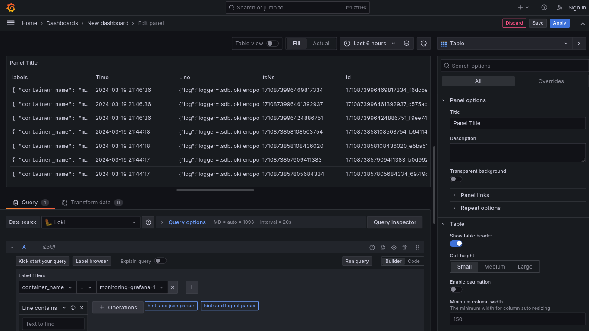
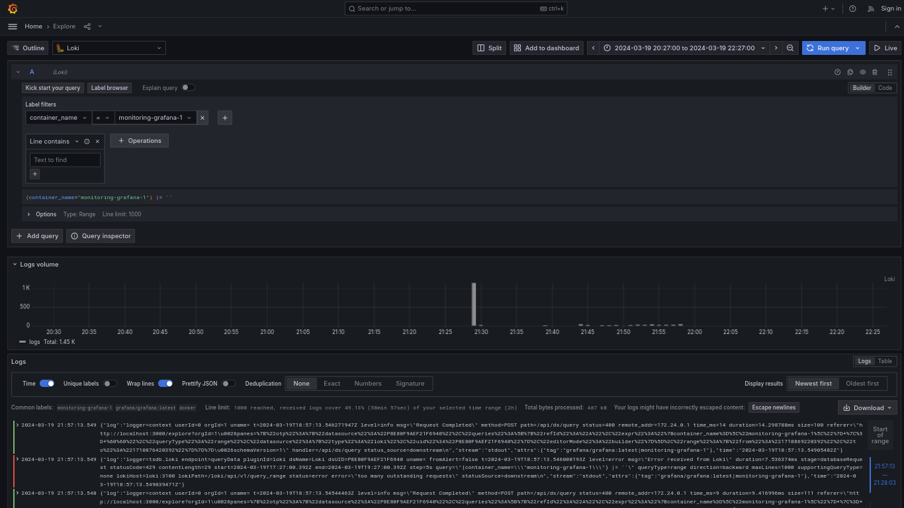
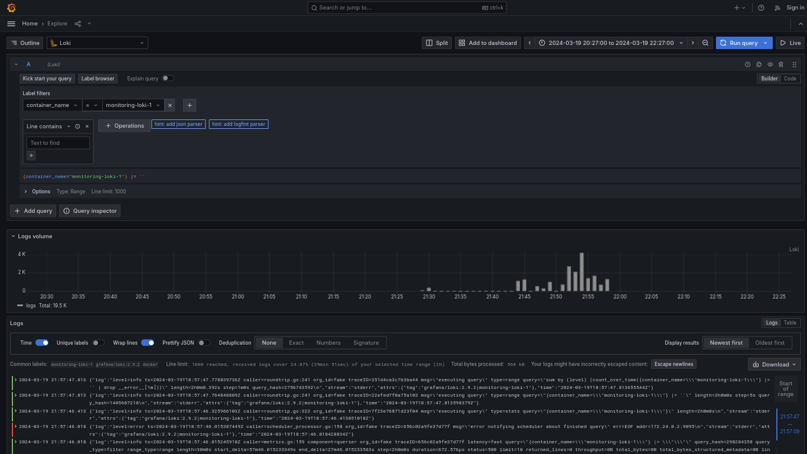
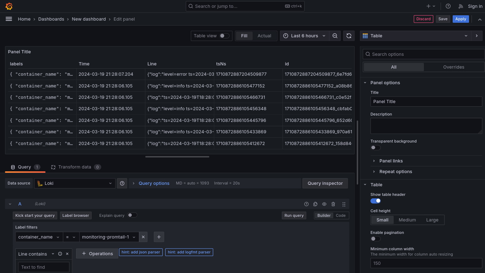
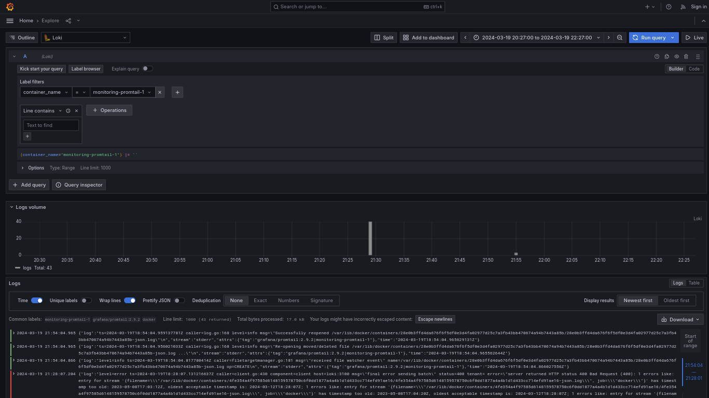
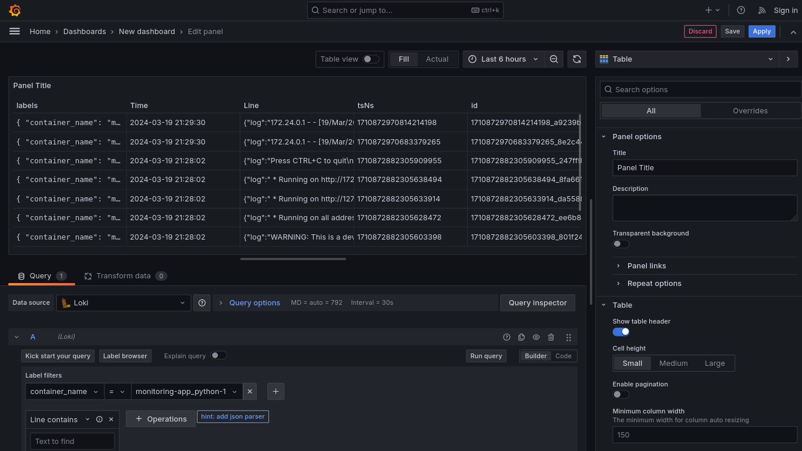
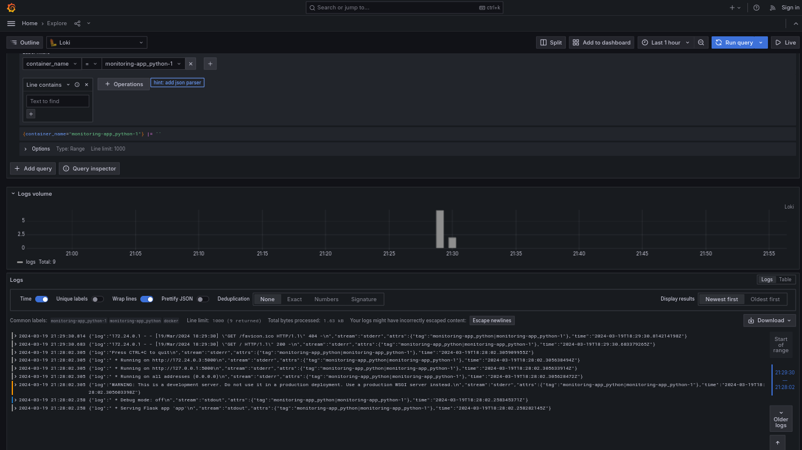

# Logging Stack Report

## Overview

The logging stack consists of several components:

1. **Grafana**: A monitoring and visualization platform.
2. **Loki**: An open-source log aggregation system.
3. **Promtail**: A log shipping agent.
4. **Python Application**: A sample Python application generating logs for monitoring.

## Components

### Grafana

- **Role**: Grafana serves as the frontend interface for monitoring and visualization of log data.
- **Functionality**:
  - Provides a user-friendly dashboard for viewing log data.
  - Enables the setup of data sources, including Loki, to query and visualize logs.
  - Supports the creation of alerts and notifications based on log data.
- **Configuration**:
  - Configured to enable anonymous access and set up a data source for Loki.

### Loki

- **Role**: Loki is responsible for collecting, storing, and querying log data.
- **Functionality**:
  - Aggregates logs from various sources, including Promtail agents.
  - Stores log data in a scalable and efficient manner, optimized for querying.
  - Provides a query language for searching and filtering log data efficiently.
- **Configuration**:
  - Configured with a local configuration file (`local-config.yaml`) to specify settings such as storage and retention policies.

### Promtail

- **Role**: Promtail is a log shipping agent responsible for collecting logs from various sources and forwarding them to Loki.
- **Functionality**:
  - Collects logs from local files and Docker container logs.
  - Sends collected logs to Loki for storage and querying.
  - Supports log scraping and enrichment through pipeline stages.
- **Configuration**:
  - Configured with a YAML file (`promtail.yml`) specifying scrape configurations, log file paths, and Loki endpoint.

### Python Application

- **Role**: Represents a sample application generating log data for monitoring.
- **Functionality**:
  - Generates log messages containing information about its execution and activities.
  - Demonstrates the integration of application logs with the logging stack.
- **Configuration**:
  - Integrated with the logging stack via Docker Compose, using the default logging configuration for log collection.

## Logging Mechanism

The logging mechanism operates as follows:

1. **Promtail** collects logs from local files and Docker container logs based on the configurations specified in `promtail.yml`.
2. Collected logs are forwarded to **Loki**, which aggregates and stores them in a scalable manner.
3. **Grafana** interacts with **Loki** as a data source, enabling users to visualize and query log data through Grafana dashboards.
4. Additionally, the Python application's logs are collected by **Promtail** and stored in **Loki**, allowing monitoring and analysis of application activities.
